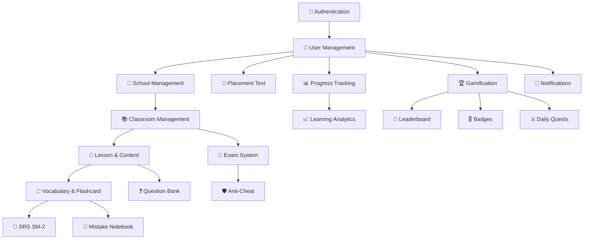

# 📘 EngAcademy LMS — System Overview

> **Version:** 1.0  
> **Last Updated:** 2026-05-21  
> **Author:** Development Team

---

## 1. Tổng Quan Dự Án (Project Overview)

**EngAcademy-LMS** là một nền tảng học tiếng Anh trực tuyến (Learning Management System) toàn diện, hỗ trợ mô hình **Multi-School** (nhiều trường học cùng sử dụng một hệ thống). Hệ thống tích hợp các phương pháp học tập hiện đại bao gồm:

- **Adaptive Learning** — Bài kiểm tra xếp lớp thích ứng theo CEFR (A1–C2)
- **Spaced Repetition System (SM-2)** — Hệ thống ôn tập lặp lại theo khoa học
- **Gamification** — Huy hiệu, nhiệm vụ hàng ngày, bảng xếp hạng, xu thưởng
- **Anti-Cheat Proctoring** — Giám sát gian lận khi thi trực tuyến
- **Real-time Notifications** — Thông báo thời gian thực qua WebSocket

---

## 2. Kiến Trúc Hệ Thống (System Architecture)

### 2.1. Tổng Quan Kiến Trúc

```
┌──────────────────────────────────────────────────────────────────┐
│                        CLIENT LAYER                              │
│  ┌──────────────┐   ┌──────────────┐   ┌──────────────────────┐ │
│  │  Student App  │   │  Admin Panel │   │  School Manager App  │ │
│  │  (React/Vite) │   │  (React/Vite)│   │  (React/Vite)        │ │
│  └──────┬───────┘   └──────┬───────┘   └──────────┬───────────┘ │
│         │                  │                       │             │
│         └──────────────────┼───────────────────────┘             │
│                            │ HTTPS / WSS                         │
├────────────────────────────┼─────────────────────────────────────┤
│                     API GATEWAY LAYER                            │
│                            │                                     │
│  ┌─────────────────────────▼─────────────────────────────────┐  │
│  │              Spring Boot Application (v3.2.2)              │  │
│  │  ┌─────────────┐ ┌──────────────┐ ┌────────────────────┐ │  │
│  │  │  Security    │ │  Rate Limit  │ │  JWT Auth Filter   │ │  │
│  │  │  Filter Chain│ │  Filter      │ │  (Bearer Token)    │ │  │
│  │  └──────┬──────┘ └──────┬───────┘ └────────┬───────────┘ │  │
│  │         └───────────────┼──────────────────┘              │  │
│  │                         ▼                                  │  │
│  │  ┌─────────────────────────────────────────────────────┐  │  │
│  │  │              PRESENTATION LAYER                      │  │  │
│  │  │  25 REST Controllers + WebSocket Message Broker      │  │  │
│  │  └──────────────────────┬──────────────────────────────┘  │  │
│  │                         ▼                                  │  │
│  │  ┌─────────────────────────────────────────────────────┐  │  │
│  │  │              APPLICATION LAYER                       │  │  │
│  │  │  36 Service Classes + DTOs + Event Handlers          │  │  │
│  │  └──────────────────────┬──────────────────────────────┘  │  │
│  │                         ▼                                  │  │
│  │  ┌─────────────────────────────────────────────────────┐  │  │
│  │  │              DOMAIN LAYER                            │  │  │
│  │  │  35 JPA Entities + 6 Enums + Business Rules          │  │  │
│  │  └──────────────────────┬──────────────────────────────┘  │  │
│  │                         ▼                                  │  │
│  │  ┌─────────────────────────────────────────────────────┐  │  │
│  │  │              INFRASTRUCTURE LAYER                    │  │  │
│  │  │  33 Repositories + Security + Config + Persistence   │  │  │
│  │  └─────────────────────────────────────────────────────┘  │  │
│  └────────────────────────────────────────────────────────────┘  │
├──────────────────────────────────────────────────────────────────┤
│                     DATA LAYER                                   │
│  ┌──────────────┐  ┌──────────────┐  ┌──────────────────────┐   │
│  │   MySQL 8.x   │  │  Redis 7.x   │  │  Gmail SMTP          │   │
│  │  (Primary DB)  │  │  (Cache/LB)  │  │  (Email/OTP)         │   │
│  └──────────────┘  └──────────────┘  └──────────────────────┘   │
└──────────────────────────────────────────────────────────────────┘
```

### 2.2. Kiến Trúc Backend (Clean Architecture / Layered)

| Layer | Thư mục | Trách nhiệm |
|:---|:---|:---|
| **Presentation** | `presentation/controller/` | 25 REST Controllers, nhận HTTP request, trả response |
| **Application** | `application/service/`, `application/dto/` | 36 Service classes, business logic, DTO mapping |
| **Domain** | `domain/entity/`, `domain/enums/` | 35 JPA Entities, 6 Enums, business rules (SM-2 algorithm) |
| **Infrastructure** | `infrastructure/security/`, `infrastructure/config/`, `infrastructure/persistence/` | Security filters, Spring configs, 33 JPA Repositories |

---

## 3. Tech Stack

### 3.1. Backend

| Thành phần | Công nghệ | Phiên bản |
|:---|:---|:---|
| Framework | Spring Boot | 3.2.2 |
| Language | Java | 17 |
| ORM | Spring Data JPA / Hibernate | — |
| Security | Spring Security + JWT (jjwt) | — |
| Database (Dev) | H2 (In-Memory) | — |
| Database (Prod) | MySQL | 8.x |
| Cache | Redis (Jedis) | 7.x |
| WebSocket | Spring WebSocket + STOMP + SockJS | — |
| API Docs | SpringDoc OpenAPI (Swagger UI) | — |
| Build Tool | Maven Wrapper (`mvnw`) | — |
| Email | Spring Mail (SMTP Gmail) | — |
| Password Hashing | BCrypt | — |

### 3.2. Frontend

| Thành phần | Công nghệ |
|:---|:---|
| Framework | React 18 + TypeScript |
| Build Tool | Vite |
| State Management | Zustand / Redux |
| UI Library | Ant Design / Custom Components |
| HTTP Client | Axios |
| WebSocket Client | SockJS + STOMP.js |
| Internationalization | i18next |
| Routing | React Router v6 |

### 3.3. Infrastructure

| Thành phần | Công nghệ |
|:---|:---|
| Containerization | Docker + Docker Compose |
| CI/CD | Render / Railway (render.yaml) |
| Monitoring | Spring Actuator |

---

## 4. Các Module Chức Năng Chính

| # | Module | Mô Tả | Controllers |
|:---|:---|:---|:---|
| 1 | **Authentication** | Đăng ký, đăng nhập, JWT, refresh token, OAuth2 Google, quên/đặt lại mật khẩu | `AuthController` |
| 2 | **User Management** | CRUD người dùng, phân quyền, profile, settings, audit log | `UserController` |
| 3 | **School Management** | CRUD trường học, quản lý theo tenant (multi-school) | `SchoolController` |
| 4 | **Classroom Management** | CRUD lớp học, gán giáo viên, thêm/xóa học sinh, liên kết trường | `ClassRoomController` |
| 5 | **Lesson & Content** | CRUD bài học, chủ đề, nội dung HTML, audio/video, độ khó | `LessonController`, `TopicController` |
| 6 | **Vocabulary & Flashcard** | CRUD từ vựng, flashcard học tập, review đúng/sai | `VocabularyController` |
| 7 | **Question Bank** | CRUD câu hỏi, đáp án, loại câu hỏi (MCQ, Fill-in, T/F, Essay) | `QuestionController` |
| 8 | **Exam System** | Tạo/công bố/đóng đề thi, shuffle câu hỏi, nộp bài, chấm điểm tự động | `ExamController` |
| 9 | **Anti-Cheat** | Giám sát tab switch, copy/paste, right-click, DevTools khi thi | `ExamController` (anti-cheat endpoints) |
| 10 | **SRS (SM-2)** | Hệ thống ôn tập lặp lại với thuật toán SM-2, lịch trình tự động | `SrsController` |
| 11 | **Placement Test** | Bài kiểm tra xếp lớp thích ứng, xác định CEFR level 4 kỹ năng | `PlacementController` |
| 12 | **Progress Tracking** | Theo dõi tiến độ bài học, thống kê học tập, tỷ lệ hoàn thành | `ProgressController` |
| 13 | **Gamification** | Huy hiệu, nhiệm vụ hàng ngày, xu thưởng, bảng xếp hạng | `BadgeController`, `DailyQuestController`, `LeaderboardController` |
| 14 | **Notifications** | Thông báo cá nhân, broadcast theo vai trò/trường/lớp, WebSocket realtime | `NotificationController` |
| 15 | **Mistake Notebook** | Sổ ghi chép lỗi sai, theo dõi từ vựng yếu | `MistakeNotebookController` |
| 16 | **Learning Analytics** | Hồ sơ học tập, phát hiện điểm yếu, đề xuất học tập cá nhân hóa | `LearningProfileController`, `RecommendationController` |
| 17 | **Dashboard** | Tổng quan thống kê cho Admin/School | `DashboardController` |

---

## 5. Môi Trường & Cách Chạy

### 5.1. Chạy Backend (Development)

```bash
cd BackEnd
./mvnw spring-boot:run -Dspring-boot.run.profiles=dev
```

- **Port:** `8080`
- **Database:** H2 In-Memory (tự động seed dữ liệu mẫu)
- **Swagger UI:** http://localhost:8080/swagger-ui.html

### 5.2. Chạy Frontend (Development)

```bash
cd FrontEnd
npm install
npm run dev
```

- **Port:** `3000`

### 5.3. Chạy bằng Docker

```bash
docker-compose up -d
```

---

## 6. Spring Profiles

| Profile | Database | Data Seeding | Swagger | Mục đích |
|:---|:---|:---|:---|:---|
| `dev` | H2 In-Memory | `DevDataSeeder` (full sample data) | ✅ Enabled | Phát triển local |
| `prod` | MySQL | `ProdDataSeeder` (minimal admin seed) | ❌ Disabled | Production |
| `test` | H2 In-Memory | Từ `data.sql` | ✅ Enabled | Unit/Integration tests |

---

## 7. Bảo Mật Tổng Quan

- **Xác thực:** JWT Bearer Token (Access Token + Refresh Token)
- **Mã hóa mật khẩu:** BCrypt
- **Rate Limiting:** IP-based, cấu hình 100 requests / 60 giây
- **CORS:** Cấu hình whitelist origins
- **WebSocket Auth:** JWT validation trên STOMP CONNECT/SUBSCRIBE
- **Swagger Protection:** Tắt được ở production qua biến môi trường
- **Audit Logging:** Ghi nhận hành động quan trọng (tạo/xóa user, trường, đổi mật khẩu)

---

## 8. Sơ Đồ Quan Hệ Module Cấp Cao


