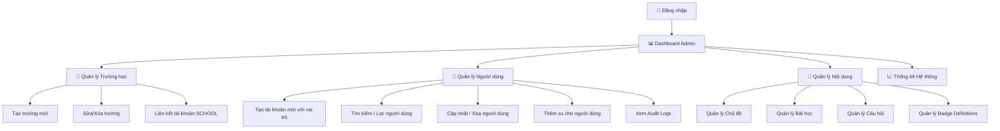
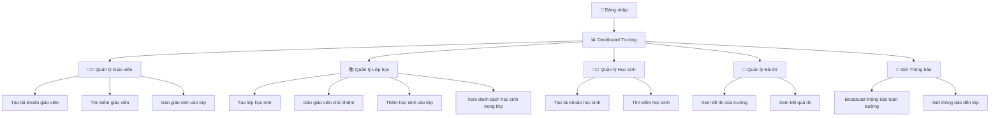
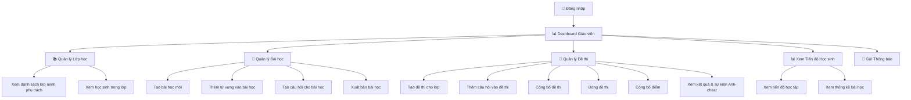
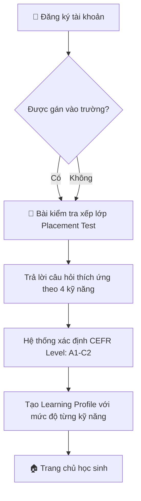
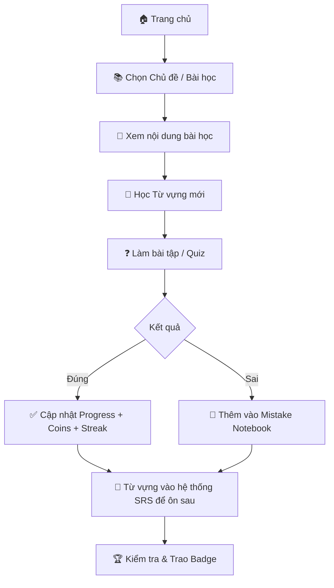
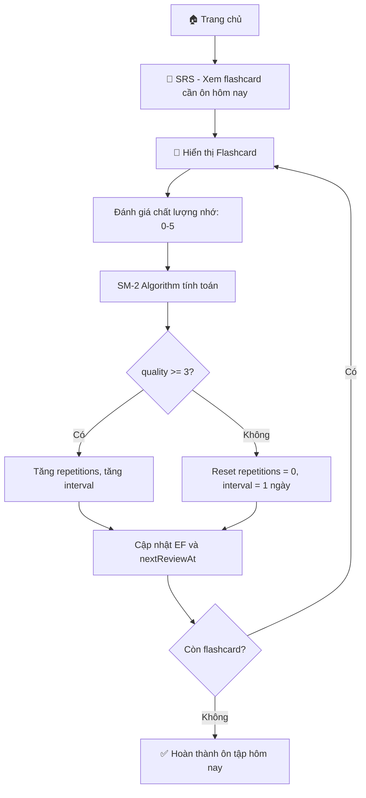
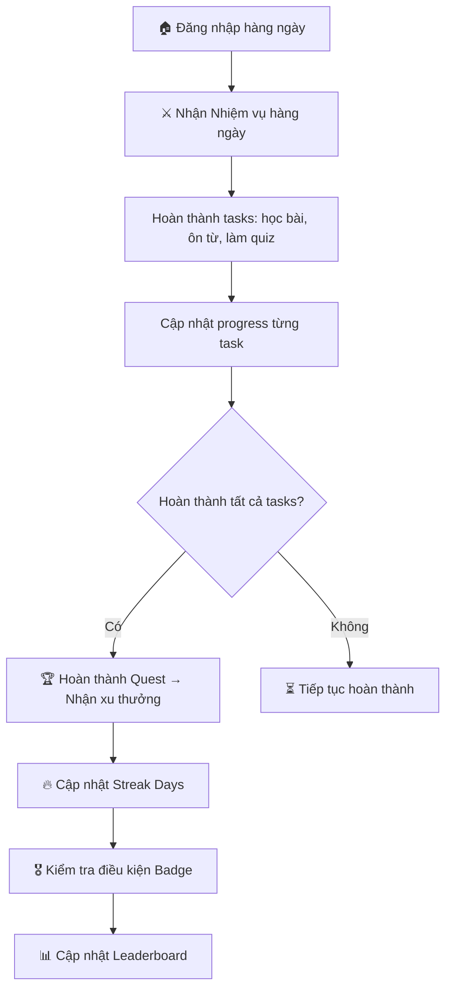
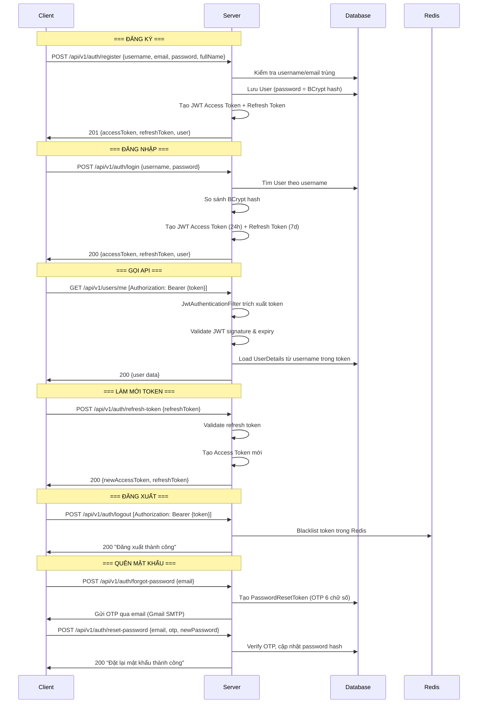
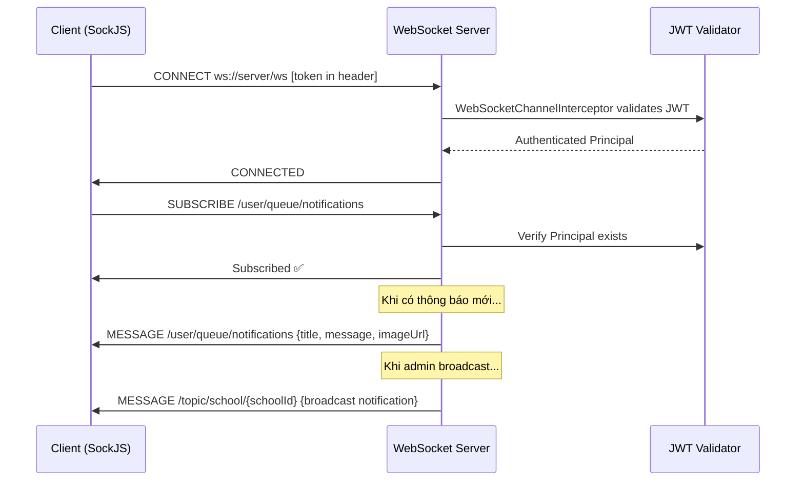

# 👤 EngAcademy LMS — User Flow

> **Version:** 1.0  
> **Last Updated:** 2026-05-21

---

## 1. Tổng Quan Vai Trò & Luồng Người Dùng

Hệ thống có **4 vai trò** chính, mỗi vai trò có luồng sử dụng riêng biệt:

| Vai Trò | Mã Vai Trò | Mô Tả |
|:---|:---|:---|
| **Admin** | `ROLE_ADMIN` | Quản trị viên hệ thống toàn cục — quản lý mọi trường, người dùng, nội dung |
| **School** | `ROLE_SCHOOL` | Quản lý trường học — quản lý giáo viên, lớp, học sinh thuộc trường mình |
| **Teacher** | `ROLE_TEACHER` | Giáo viên — tạo bài học, đề thi, quản lý lớp học |
| **Student** | `ROLE_STUDENT` | Học sinh — học bài, thi, ôn tập, gamification |

---

## 2. Luồng Admin (System Administrator)



### Các thao tác chính của Admin:
1. **Đăng nhập** → `POST /api/v1/auth/login`
2. **Tạo trường học** → `POST /api/v1/schools`
3. **Tạo tài khoản School Manager** → `POST /api/v1/users` (role = `ROLE_SCHOOL`, gán schoolId)
4. **Quản lý nội dung toàn cục** — Bài học, chủ đề, từ vựng, câu hỏi
5. **Xem thống kê tổng hợp** → `GET /api/v1/users/stats`

---

## 3. Luồng School Manager (Quản Lý Trường)



### Quy tắc quan trọng:
- School Manager **chỉ nhìn thấy** dữ liệu thuộc trường mình (`schoolId` filtering)
- Không thể truy cập dữ liệu của trường khác (Multi-school Isolation)

---

## 4. Luồng Giáo Viên (Teacher)



### Luồng tạo và quản lý đề thi:
```
Tạo đề thi (DRAFT) → Thêm câu hỏi → Công bố (PUBLISHED) → Học sinh làm bài → Đóng (CLOSED) → Công bố điểm
```

---

## 5. Luồng Học Sinh (Student) — Chi Tiết Nhất

### 5.1. Luồng Onboarding (Lần đầu sử dụng)



### 5.2. Luồng Học Bài



### 5.3. Luồng Ôn Tập SRS (Spaced Repetition)



### 5.4. Luồng Thi (Exam Flow + Anti-cheat)

```mermaid
flowchart TD
    A[🏠 Trang chủ] --> B[📝 Xem đề thi đang mở cho lớp mình]
    B --> C[Bắt đầu bài thi: POST /exams/{id}/start]
    C --> D[Hệ thống tạo ExamResult, shuffle câu hỏi/đáp án]
    D --> E[🖥️ Giao diện làm bài thi]
    
    E --> F[⚠️ Anti-Cheat Monitor chạy nền]
    F --> F1[Phát hiện Tab Switch → Log event]
    F --> F2[Phát hiện Copy/Paste → Log event]
    F --> F3[Phát hiện Right Click → Log event]
    F --> F4[Phát hiện DevTools → Log event]
    
    E --> G[Chọn đáp án cho từng câu]
    G --> H[📤 Nộp bài: POST /exams/{id}/submit-anticheat]
    H --> I[Hệ thống chấm điểm tự động]
    I --> J[Lưu ExamResult với score, violationCount]
    J --> K{Điểm đã được công bố?}
    K -->|Có| L[📊 Xem kết quả]
    K -->|Không| M[⏳ Chờ giáo viên công bố điểm]
```

### 5.5. Luồng Gamification Hàng Ngày



---

## 6. Luồng Xác Thực Chi Tiết (Authentication Flow)



---

## 7. Luồng Thông Báo Realtime (WebSocket)


