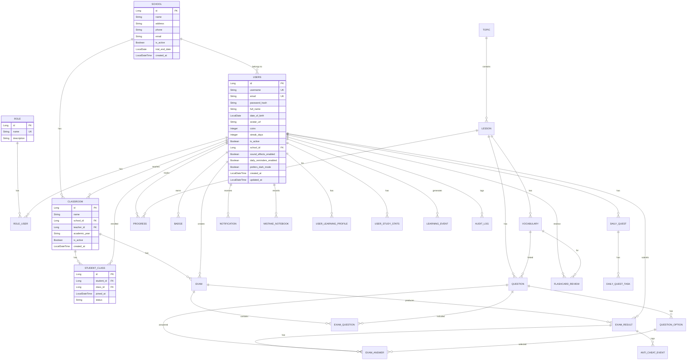

# 🗄️ EngAcademy LMS — Database Schema

> **Version:** 1.0  
> **Last Updated:** 2026-05-21  
> **ORM:** Spring Data JPA / Hibernate  
> **Dev DB:** H2 In-Memory | **Prod DB:** MySQL 8.x

---

## 1. Entity Relationship Diagram (ERD)

---

## 2. Chi Tiết Bảng (Table Specifications)

### 2.1. Core User Tables

#### `ROLE`
| Cột | Kiểu | Constraint | Mô Tả |
|:---|:---|:---|:---|
| `id` | BIGINT | PK, AUTO_INCREMENT | |
| `name` | VARCHAR(50) | NOT NULL, UNIQUE | `ROLE_ADMIN`, `ROLE_SCHOOL`, `ROLE_TEACHER`, `ROLE_STUDENT` |
| `description` | VARCHAR(255) | | Mô tả vai trò |

#### `USERS`
| Cột | Kiểu | Constraint | Mô Tả |
|:---|:---|:---|:---|
| `id` | BIGINT | PK, AUTO_INCREMENT | |
| `username` | VARCHAR(50) | NOT NULL, UNIQUE | Tên đăng nhập |
| `email` | VARCHAR(100) | NOT NULL, UNIQUE | Email |
| `password_hash` | VARCHAR(255) | NOT NULL | BCrypt hash |
| `full_name` | VARCHAR(100) | | Họ và tên |
| `date_of_birth` | DATE | | Ngày sinh |
| `avatar_url` | VARCHAR(500) | | URL ảnh đại diện |
| `coins` | INT | DEFAULT 0 | Xu thưởng |
| `streak_days` | INT | DEFAULT 0 | Số ngày liên tục |
| `is_active` | BOOLEAN | DEFAULT TRUE | Trạng thái |
| `school_id` | BIGINT | FK → SCHOOL.id | Trường thuộc về |
| `sound_effects_enabled` | BOOLEAN | DEFAULT TRUE | Cài đặt âm thanh |
| `daily_reminders_enabled` | BOOLEAN | DEFAULT TRUE | Nhắc nhở hàng ngày |
| `prefers_dark_mode` | BOOLEAN | NULLABLE | Chế độ tối |
| `created_at` | DATETIME | | Thời điểm tạo |
| `updated_at` | DATETIME | | Thời điểm cập nhật |

**Indexes:** `idx_user_coins(coins)`, `idx_user_streak(streak_days)`, `idx_user_school(school_id)`

#### `ROLE_USER` (Join Table)
| Cột | Kiểu | Constraint |
|:---|:---|:---|
| `user_id` | BIGINT | FK → USERS.id |
| `role_id` | BIGINT | FK → ROLE.id |

---

### 2.2. School & Classroom Tables

#### `SCHOOL`
| Cột | Kiểu | Constraint | Mô Tả |
|:---|:---|:---|:---|
| `id` | BIGINT | PK | |
| `name` | VARCHAR(200) | NOT NULL | Tên trường |
| `address` | VARCHAR(500) | | Địa chỉ |
| `phone` | VARCHAR(20) | | Số điện thoại |
| `email` | VARCHAR(100) | | Email trường |
| `is_active` | BOOLEAN | DEFAULT TRUE | Trạng thái |
| `trial_end_date` | DATE | | Ngày hết dùng thử |
| `created_at` | DATETIME | | |

#### `CLASS`
| Cột | Kiểu | Constraint | Mô Tả |
|:---|:---|:---|:---|
| `id` | BIGINT | PK | |
| `name` | VARCHAR(100) | NOT NULL | Tên lớp |
| `school_id` | BIGINT | FK → SCHOOL.id, NOT NULL | Thuộc trường |
| `teacher_id` | BIGINT | FK → USERS.id | Giáo viên chủ nhiệm |
| `academic_year` | VARCHAR(20) | | Năm học |
| `is_active` | BOOLEAN | DEFAULT TRUE | |
| `created_at` | DATETIME | | |

#### `STUDENT_CLASS`
| Cột | Kiểu | Constraint | Mô Tả |
|:---|:---|:---|:---|
| `id` | BIGINT | PK | |
| `student_id` | BIGINT | FK → USERS.id, NOT NULL | |
| `class_id` | BIGINT | FK → CLASS.id, NOT NULL | |
| `joined_at` | DATETIME | | Thời điểm tham gia |
| `status` | VARCHAR(20) | | ACTIVE, INACTIVE |

---

### 2.3. Learning Content Tables

#### `TOPIC`
| Cột | Kiểu | Constraint |
|:---|:---|:---|
| `id` | BIGINT | PK |
| `name` | VARCHAR(200) | NOT NULL |

#### `LESSON`
| Cột | Kiểu | Constraint | Mô Tả |
|:---|:---|:---|:---|
| `id` | BIGINT | PK | |
| `title` | VARCHAR(200) | NOT NULL | Tiêu đề bài học |
| `topic_id` | BIGINT | FK → TOPIC.id | Thuộc chủ đề |
| `content_html` | TEXT | | Nội dung HTML |
| `grammar_html` | TEXT | | Ngữ pháp HTML |
| `audio_url` | VARCHAR(500) | | Audio bài học |
| `video_url` | VARCHAR(500) | | Video bài học |
| `difficulty_level` | INT | | Độ khó (1-5) |
| `order_index` | INT | | Thứ tự sắp xếp |
| `is_published` | BOOLEAN | DEFAULT FALSE | Đã xuất bản |

#### `VOCABULARY`
| Cột | Kiểu | Constraint |
|:---|:---|:---|
| `id` | BIGINT | PK |
| `lesson_id` | BIGINT | FK → LESSON.id, NOT NULL |
| `word` | VARCHAR(100) | NOT NULL |
| `pronunciation` | VARCHAR(100) | |
| `meaning` | TEXT | |
| `example_sentence` | TEXT | |
| `image_url` | VARCHAR(500) | |
| `audio_url` | VARCHAR(500) | |

#### `QUESTION`
| Cột | Kiểu | Constraint | Mô Tả |
|:---|:---|:---|:---|
| `id` | BIGINT | PK | |
| `lesson_id` | BIGINT | FK → LESSON.id | |
| `vocabulary_id` | BIGINT | FK → VOCABULARY.id | Liên kết từ vựng |
| `question_type` | VARCHAR(50) | | `MULTIPLE_CHOICE`, `FILL_IN_BLANK`, `TRUE_FALSE`, `ESSAY` |
| `question_text` | TEXT | NOT NULL | Nội dung câu hỏi |
| `points` | INT | DEFAULT 1 | Điểm |
| `explanation` | TEXT | | Giải thích đáp án |

**Indexes:** `idx_question_lesson`, `idx_question_vocab`, `idx_question_type`

#### `QUESTION_OPTION`
| Cột | Kiểu | Constraint |
|:---|:---|:---|
| `id` | BIGINT | PK |
| `question_id` | BIGINT | FK → QUESTION.id, NOT NULL |
| `option_text` | TEXT | NOT NULL |
| `is_correct` | BOOLEAN | DEFAULT FALSE |

---

### 2.4. Exam Tables

#### `EXAM`
| Cột | Kiểu | Constraint | Mô Tả |
|:---|:---|:---|:---|
| `id` | BIGINT | PK | |
| `title` | VARCHAR(200) | NOT NULL | Tiêu đề đề thi |
| `teacher_id` | BIGINT | FK → USERS.id, NOT NULL | Giáo viên tạo |
| `class_id` | BIGINT | FK → CLASS.id, NOT NULL | Lớp thi |
| `start_time` | DATETIME | NOT NULL | Thời gian bắt đầu |
| `end_time` | DATETIME | NOT NULL | Thời gian kết thúc |
| `duration_minutes` | INT | NOT NULL | Thời lượng (phút) |
| `shuffle_questions` | BOOLEAN | DEFAULT TRUE | Xáo trộn câu hỏi |
| `shuffle_answers` | BOOLEAN | DEFAULT TRUE | Xáo trộn đáp án |
| `anti_cheat_enabled` | BOOLEAN | DEFAULT TRUE | Bật anti-cheat |
| `status` | VARCHAR(20) | DEFAULT 'DRAFT' | `DRAFT`, `PUBLISHED`, `CLOSED` |
| `score_published` | BOOLEAN | DEFAULT FALSE | Đã công bố điểm |

**Indexes:** `idx_exam_class`, `idx_exam_teacher`, `idx_exam_status`, `idx_exam_time`

#### `EXAM_QUESTION` (Join Table)
| Cột | Kiểu |
|:---|:---|
| `exam_id` | BIGINT FK |
| `question_id` | BIGINT FK |

#### `EXAM_RESULT`
| Cột | Kiểu | Constraint | Mô Tả |
|:---|:---|:---|:---|
| `id` | BIGINT | PK | |
| `exam_id` | BIGINT | FK, NOT NULL | |
| `student_id` | BIGINT | FK, NOT NULL | |
| `score` | DECIMAL(5,2) | | Điểm |
| `correct_count` | INT | | Số câu đúng |
| `total_questions` | INT | | Tổng số câu |
| `submitted_at` | DATETIME | | Thời điểm nộp |
| `violation_count` | INT | DEFAULT 0 | Số lần vi phạm |

**Unique Constraint:** `uc_exam_student(exam_id, student_id)` — Mỗi học sinh chỉ nộp 1 lần/đề  
**Indexes:** `idx_exam_result_user`, `idx_exam_result_exam`, `idx_exam_result_submitted`

#### `EXAM_ANSWER`
| Cột | Kiểu | Constraint |
|:---|:---|:---|
| `id` | BIGINT | PK |
| `exam_result_id` | BIGINT | FK → EXAM_RESULT.id, NOT NULL |
| `question_id` | BIGINT | FK → QUESTION.id, NOT NULL |
| `selected_option_id` | BIGINT | FK → QUESTION_OPTION.id |
| `is_correct` | BOOLEAN | |

#### `ANTI_CHEAT_EVENT`
| Cột | Kiểu | Constraint | Mô Tả |
|:---|:---|:---|:---|
| `id` | BIGINT | PK | |
| `exam_result_id` | BIGINT | FK → EXAM_RESULT.id, NOT NULL | |
| `event_type` | VARCHAR(50) | NOT NULL | `TAB_SWITCH`, `COPY`, `PASTE`, `BLUR`, `RIGHT_CLICK`, `DEV_TOOLS` |
| `event_time` | DATETIME | NOT NULL | |
| `details` | TEXT | | Chi tiết sự kiện |

**Indexes:** `idx_anticheat_exam_result`, `idx_anticheat_time`, `idx_anticheat_type`

---

### 2.5. SRS & Learning Tables

#### `FLASHCARD_REVIEW`
| Cột | Kiểu | Constraint | Mô Tả |
|:---|:---|:---|:---|
| `id` | BIGINT | PK | |
| `version` | BIGINT | `@Version` (Optimistic Lock) | Chống concurrent update |
| `user_id` | BIGINT | FK, NOT NULL | |
| `vocabulary_id` | BIGINT | FK | |
| `grammar_id` | BIGINT | FK | |
| `easiness_factor` | DOUBLE | NOT NULL, DEFAULT 2.5 | EF trong SM-2 |
| `interval_days` | INT | NOT NULL, DEFAULT 1 | Khoảng cách ôn (ngày) |
| `repetitions` | INT | NOT NULL, DEFAULT 0 | Số lần ôn thành công liên tiếp |
| `next_review_at` | DATE | NOT NULL | Ngày ôn tiếp theo |
| `last_reviewed_at` | DATETIME | | Lần ôn gần nhất |
| `created_at` | DATETIME | | |
| `updated_at` | DATETIME | | |

**Unique Constraints:** `idx_review_user_vocab(user_id, vocabulary_id)`, `idx_review_user_grammar(user_id, grammar_id)`  
**Indexes:** `idx_review_user_next(user_id, next_review_at)`, `idx_review_vocab_user(user_id, vocabulary_id)`

#### `PROGRESS`
| Cột | Kiểu | Constraint |
|:---|:---|:---|
| `id` | BIGINT | PK |
| `user_id` | BIGINT | FK, NOT NULL |
| `lesson_id` | BIGINT | FK, NOT NULL |
| `completion_percentage` | INT | DEFAULT 0 |
| `last_accessed` | DATETIME | |
| `is_completed` | BOOLEAN | DEFAULT FALSE |

**Unique Constraint:** `(user_id, lesson_id)`  
**Indexes:** `idx_progress_user`, `idx_progress_lesson`, `idx_progress_completed`

#### `USER_LEARNING_PROFILE`
| Cột | Kiểu | Constraint | Mô Tả |
|:---|:---|:---|:---|
| `id` | BIGINT | PK | |
| `user_id` | BIGINT | FK, NOT NULL, UNIQUE | 1:1 với User |
| `grammar_level` | ENUM | NOT NULL, DEFAULT 'A1' | CEFR Grammar |
| `vocabulary_level` | ENUM | NOT NULL, DEFAULT 'A1' | CEFR Vocabulary |
| `reading_level` | ENUM | NOT NULL, DEFAULT 'A1' | CEFR Reading |
| `listening_level` | ENUM | NOT NULL, DEFAULT 'A1' | CEFR Listening |
| `overall_level` | ENUM | NOT NULL, DEFAULT 'A1' | Tổng hợp (tính trung bình) |
| `primary_goal` | ENUM | NOT NULL | `COMMUNICATION`, etc. |
| `daily_target_minutes` | INT | DEFAULT 15 | Mục tiêu hàng ngày |
| `onboarding_completed` | BOOLEAN | DEFAULT FALSE | |

#### `PLACEMENT_QUESTION`
| Cột | Kiểu | Constraint | Mô Tả |
|:---|:---|:---|:---|
| `id` | BIGINT | PK | |
| `skill` | ENUM | NOT NULL | `GRAMMAR`, `VOCABULARY`, `READING`, `LISTENING` |
| `cefr_band` | ENUM | NOT NULL | `A1`–`C2` |
| `difficulty_weight` | DOUBLE | DEFAULT 0.5 | |
| `question_text` | TEXT | NOT NULL | |
| `correct_answer` | VARCHAR(500) | | |
| `option_a/b/c/d` | VARCHAR(500) | | 4 đáp án |
| `is_active` | BOOLEAN | DEFAULT TRUE | |

---

### 2.6. Gamification Tables

#### `BADGE`
| Cột | Kiểu | Constraint |
|:---|:---|:---|
| `id` | BIGINT | PK |
| `user_id` | BIGINT | FK, NOT NULL |
| `name` | VARCHAR(100) | NOT NULL |
| `description` | VARCHAR(500) | |
| `icon_url` | VARCHAR(500) | |
| `earned_at` | DATETIME | |

#### `BADGE_DEFINITION`
| Cột | Kiểu | Constraint | Mô Tả |
|:---|:---|:---|:---|
| `id` | BIGINT | PK | |
| `badge_key` | VARCHAR(50) | NOT NULL, UNIQUE | Mã badge (e.g. `STREAK_7`) |
| `name` | VARCHAR(100) | NOT NULL | Tên hiển thị |
| `description` | VARCHAR(500) | | |
| `icon_emoji` | VARCHAR(10) | | Emoji icon |
| `group_name` | ENUM | NOT NULL | `STREAK`, `LEARNING`, `QUIZ`, etc. |
| `difficulty` | ENUM | NOT NULL | `BRONZE`, `SILVER`, `GOLD`, etc. |
| `is_secret` | BOOLEAN | DEFAULT FALSE | Badge ẩn |

#### `DAILY_QUEST`
| Cột | Kiểu | Constraint |
|:---|:---|:---|
| `id` | BIGINT | PK |
| `user_id` | BIGINT | FK, NOT NULL |
| `quest_date` | DATE | NOT NULL |
| `is_completed` | BOOLEAN | DEFAULT FALSE |

#### `DAILY_QUEST_TASK`
| Cột | Kiểu | Constraint |
|:---|:---|:---|
| `id` | BIGINT | PK |
| `daily_quest_id` | BIGINT | FK |
| *task fields* | | |

---

### 2.7. Other Tables

#### `NOTIFICATION`
| Cột | Kiểu | Constraint |
|:---|:---|:---|
| `id` | BIGINT | PK |
| `user_id` | BIGINT | FK, NOT NULL |
| `title` | VARCHAR(200) | NOT NULL |
| `message` | TEXT | |
| `is_read` | BOOLEAN | DEFAULT FALSE |
| `image_url` | VARCHAR(500) | |
| `created_at` | DATETIME | |

#### `MISTAKE_NOTEBOOK`
| Cột | Kiểu | Constraint |
|:---|:---|:---|
| `id` | BIGINT | PK |
| `user_id` | BIGINT | FK, NOT NULL |
| `vocabulary_id` | BIGINT | FK |
| `mistake_count` | INT | DEFAULT 1 |
| `user_recording_url` | VARCHAR(500) | |
| `added_at` | DATETIME | |

#### `AUDIT_LOG`
| Cột | Kiểu | Constraint |
|:---|:---|:---|
| `id` | BIGINT | PK |
| `user_id` | BIGINT | |
| `action` | VARCHAR(100) | |
| `details` | TEXT | |
| `ip_address` | VARCHAR(50) | |
| `user_agent` | VARCHAR(500) | |

#### `PASSWORD_RESET_TOKEN`
| Cột | Kiểu | Constraint |
|:---|:---|:---|
| `id` | BIGINT | PK |
| `user_id` | BIGINT | FK |
| `token` | VARCHAR(255) | |
| `expiry_date` | DATETIME | |

---

## 3. Tổng Kết

| Loại | Số Lượng |
|:---|:---|
| **Entity classes** | 35 |
| **Repository interfaces** | 33 |
| **Bảng chính** | ~30 |
| **Join tables** | 4 (`ROLE_USER`, `EXAM_QUESTION`, `PROFILE_PREFERRED_TOPICS`, `PROFILE_WEAK_SKILLS`) |
| **Unique Constraints** | 7 |
| **Indexes** | 20+ |
| **Optimistic Locking** | `FLASHCARD_REVIEW.version` |
