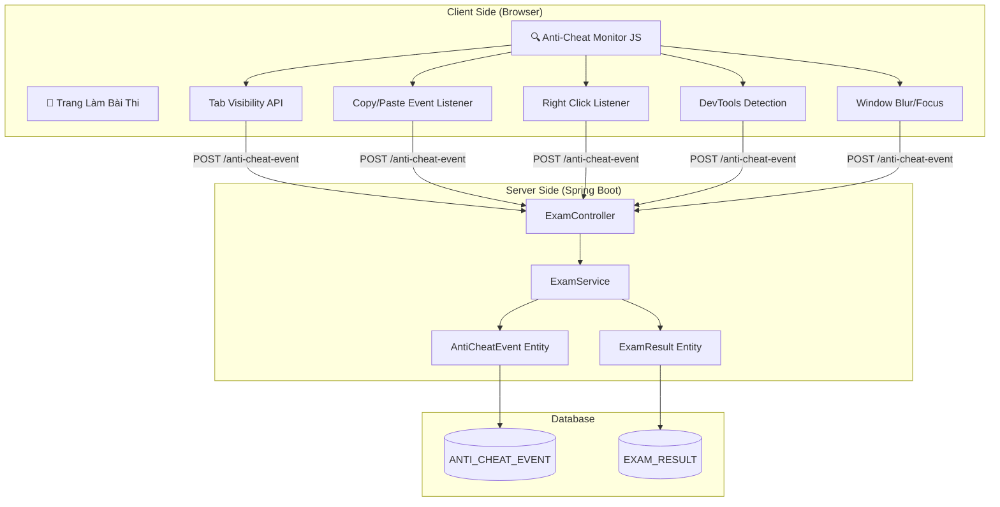
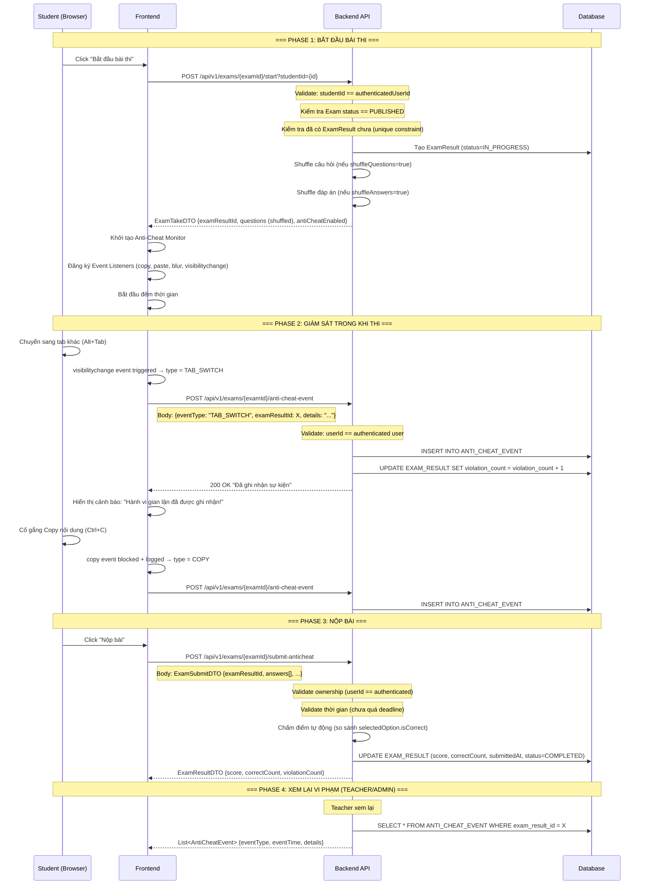
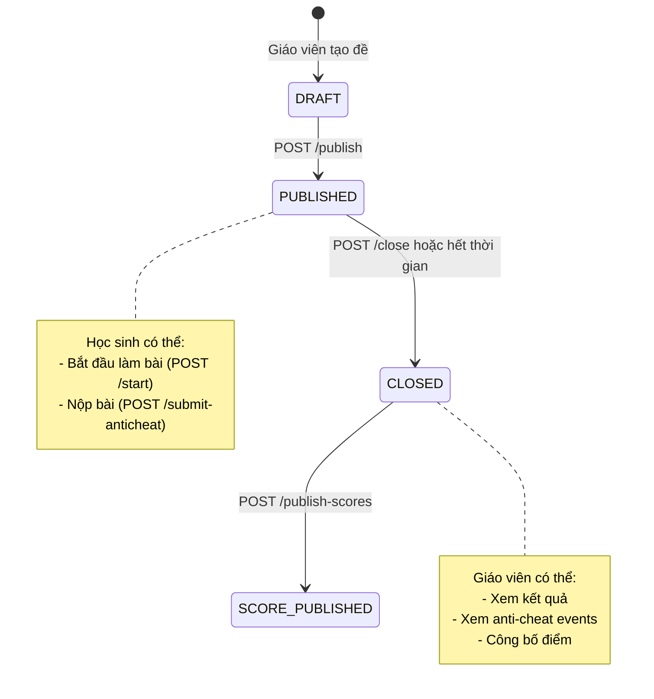

# 🛡️ EngAcademy LMS — Anti-Cheat Flow

> **Version:** 1.0  
> **Last Updated:** 2026-05-21

---

## 1. Tổng Quan Cơ Chế Anti-Cheat

Hệ thống Anti-Cheat giám sát hành vi học sinh trong suốt quá trình làm bài thi trực tuyến. Mọi hành vi vi phạm đều được **ghi nhận real-time** và lưu vào database để giáo viên/admin xem lại.

### Các loại sự kiện vi phạm:

| Mã Sự Kiện | Mô Tả | Mức Độ |
|:---|:---|:---|
| `TAB_SWITCH` | Chuyển sang tab/cửa sổ khác | ⚠️ Cao |
| `COPY` | Copy nội dung đề thi | ⚠️ Cao |
| `PASTE` | Paste nội dung vào bài thi | ⚠️ Cao |
| `BLUR` | Mất focus khỏi trang thi | 🔶 Trung bình |
| `RIGHT_CLICK` | Click chuột phải trên trang thi | 🔷 Thấp |
| `DEV_TOOLS` | Mở Developer Tools (F12) | ⚠️ Cao |

---

## 2. Kiến Trúc Anti-Cheat



---

## 3. Luồng Chi Tiết (Sequence Diagram)



---

## 4. Entity Model

### 4.1. AntiCheatEvent Entity

```java
@Entity
@Table(name = "ANTI_CHEAT_EVENT")
public class AntiCheatEvent {
    @Id @GeneratedValue
    private Long id;
    
    @ManyToOne(fetch = FetchType.LAZY)
    @JoinColumn(name = "exam_result_id", nullable = false)
    private ExamResult examResult;
    
    @Column(name = "event_type", nullable = false, length = 50)
    private String eventType;  // TAB_SWITCH, COPY, PASTE, BLUR, RIGHT_CLICK, DEV_TOOLS
    
    @Column(name = "event_time", nullable = false)
    private LocalDateTime eventTime;
    
    @Column(columnDefinition = "TEXT")
    private String details;
}
```

### 4.2. Exam Entity (Anti-Cheat Fields)

```java
@Entity
public class Exam {
    // ... other fields
    
    @Column(name = "shuffle_questions", columnDefinition = "boolean default true")
    private Boolean shuffleQuestions = true;
    
    @Column(name = "shuffle_answers", columnDefinition = "boolean default true")
    private Boolean shuffleAnswers = true;
    
    @Column(name = "anti_cheat_enabled", columnDefinition = "boolean default true")
    private Boolean antiCheatEnabled = true;
}
```

### 4.3. ExamResult Entity (Violation Count)

```java
@Entity
public class ExamResult {
    // ... other fields
    
    @Column(name = "violation_count", columnDefinition = "int default 0")
    private Integer violationCount = 0;
}
```

---

## 5. API Endpoints

| # | Method | Endpoint | Role | Mô Tả |
|:---|:---|:---|:---|:---|
| 1 | `POST` | `/exams/{examId}/start?studentId=` | STUDENT | Bắt đầu phiên thi, tạo ExamResult, shuffle |
| 2 | `POST` | `/exams/{examId}/anti-cheat-event` | STUDENT | Ghi nhận sự kiện vi phạm |
| 3 | `POST` | `/exams/{examId}/submit-anticheat` | STUDENT | Nộp bài thi (có anti-cheat validation) |
| 4 | `GET` | `/exams/results/{resultId}/anti-cheat-events` | TEACHER, ADMIN, SCHOOL | Xem lịch sử vi phạm |

### Request Body cho Anti-Cheat Event:

```json
{
  "eventType": "TAB_SWITCH",
  "examResultId": 42,
  "details": "Chuyển tab tại câu hỏi #3"
}
```

---

## 6. Security Considerations

### 6.1. Ownership Validation
```
- startExam: studentId PHẢI == authenticatedUserId
  → Ngăn chặn student A bắt đầu thi cho student B
  
- logAntiCheatEvent: userId tự động lấy từ JWT token
  → Ngăn chặn giả mạo sự kiện anti-cheat

- submitExamWithAntiCheat: userId tự động lấy từ JWT token  
  → Ngăn chặn nộp bài thay người khác
```

### 6.2. Anti-Spoofing
```
- Sự kiện anti-cheat CHỨA timestamp server-side (LocalDateTime.now())
- Client không thể giả mạo thời gian sự kiện
- violationCount được cộng dồn trên server, không nhận từ client
```

### 6.3. Shuffle Protection
```
- Câu hỏi và đáp án được shuffle trên server
- Mỗi student nhận thứ tự khác nhau
- Ngăn chặn chia sẻ đáp án theo vị trí
```

---

## 7. Sơ Đồ Trạng Thái Đề Thi


