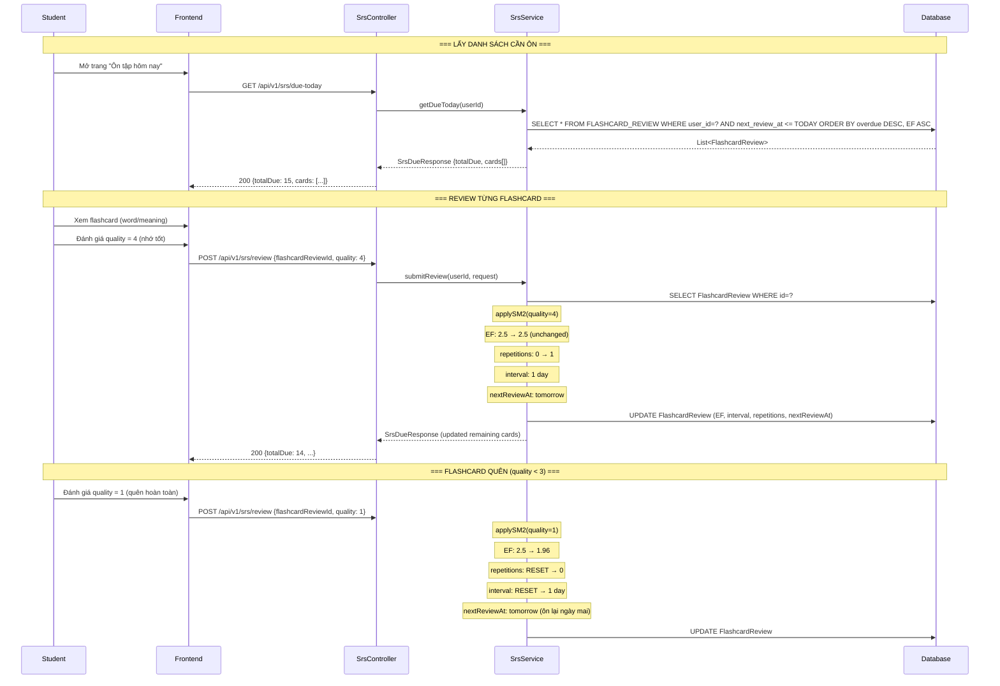

# 🔄 EngAcademy LMS — SM-2 Algorithm Flow

> **Version:** 1.0  
> **Last Updated:** 2026-05-21  
> **Reference:** SuperMemo SM-2 Algorithm by Piotr Woźniak

---

## 1. Tổng Quan SM-2

**SM-2** (SuperMemo 2) là thuật toán **Spaced Repetition** (Lặp lại cách quãng) giúp tối ưu hóa việc ghi nhớ dài hạn bằng cách tự động lên lịch ôn tập dựa trên chất lượng nhớ của người học.

### Mục Tiêu:
- Giảm thiểu số lần ôn tập cần thiết
- Tối đa hóa khả năng nhớ dài hạn
- Tự động điều chỉnh lịch trình theo hiệu suất cá nhân

---

## 2. Các Thông Số Chính

| Thông Số | Ký Hiệu | Giá Trị Mặc Định | Mô Tả |
|:---|:---|:---|:---|
| **Easiness Factor** | `EF` | `2.5` | Hệ số dễ nhớ (min: 1.3) |
| **Interval** | `I` | `1` ngày | Khoảng cách giữa 2 lần ôn |
| **Repetitions** | `n` | `0` | Số lần ôn thành công liên tiếp |
| **Quality** | `q` | `0–5` | Chất lượng nhớ do user đánh giá |
| **Next Review** | `nextReviewAt` | Ngày hiện tại + I | Ngày ôn tiếp theo |

### Thang Điểm Quality (0-5):

| Quality | Ý Nghĩa | Hành Động |
|:---|:---|:---|
| 0 | Hoàn toàn quên | Reset, ôn lại ngay |
| 1 | Sai hoàn toàn | Reset, ôn lại ngay |
| 2 | Sai nhưng gợi ý nhớ | Reset, ôn lại ngay |
| 3 | Đúng nhưng khó nhớ | Tiếp tục, tăng interval |
| 4 | Đúng với chút do dự | Tiếp tục, tăng interval |
| 5 | Nhớ hoàn hảo | Tiếp tục, tăng interval nhanh |

---

## 3. Thuật Toán SM-2 Chi Tiết

### 3.1. Pseudocode

```
FUNCTION applySM2(quality):
    IF quality >= 3:    // ĐÃ NHỚ
        IF repetitions == 0:
            interval = 1          // Lần đầu: ôn sau 1 ngày
        ELSE IF repetitions == 1:
            interval = 6          // Lần 2: ôn sau 6 ngày
        ELSE:
            interval = ROUND(interval * EF)  // Các lần sau: nhân với EF
        
        repetitions = repetitions + 1
    
    ELSE:               // CHƯA NHỚ (quality < 3)
        repetitions = 0
        interval = 1              // Reset: ôn lại sau 1 ngày
    
    // Cập nhật Easiness Factor
    EF = EF + (0.1 - (5 - quality) * (0.08 + (5 - quality) * 0.02))
    EF = MAX(EF, 1.3)            // EF không dưới 1.3
    
    // Tính ngày ôn tiếp theo
    nextReviewAt = today + interval days
```

### 3.2. Công Thức EF

```
EF' = EF + (0.1 - (5 - q) * (0.08 + (5 - q) * 0.02))
```

| Quality (q) | Thay đổi EF | Ví dụ (EF=2.5) |
|:---|:---|:---|
| 5 | +0.10 | 2.5 → 2.60 |
| 4 | +0.00 | 2.5 → 2.50 |
| 3 | −0.14 | 2.5 → 2.36 |
| 2 | −0.32 | 2.5 → 2.18 |
| 1 | −0.54 | 2.5 → 1.96 |
| 0 | −0.80 | 2.5 → 1.70 |

---

## 4. Implementation Trong Code

### 4.1. Entity: `FlashcardReview`

```java
@Entity
@Table(name = "FLASHCARD_REVIEW")
public class FlashcardReview {
    @Id @GeneratedValue
    private Long id;
    
    @Version  // Optimistic Locking — ngăn concurrent updates
    private Long version;
    
    @ManyToOne private User user;
    @ManyToOne private Vocabulary vocabulary;
    @ManyToOne private Grammar grammar;
    
    private double easinessFactor = 2.5;    // EF
    private int intervalDays = 1;            // I
    private int repetitions = 0;             // n
    private LocalDate nextReviewAt;          // Ngày ôn tiếp
    private LocalDateTime lastReviewedAt;
    
    /**
     * Áp dụng thuật toán SM-2
     * @param quality 0-5 (chất lượng nhớ)
     */
    public void applySM2(int quality) {
        if (quality < 0 || quality > 5) {
            throw new IllegalArgumentException("Quality must be 0-5");
        }
        
        if (quality >= 3) {
            // Đã nhớ → tăng interval
            if (repetitions == 0) {
                intervalDays = 1;
            } else if (repetitions == 1) {
                intervalDays = 6;
            } else {
                intervalDays = (int) Math.round(intervalDays * easinessFactor);
            }
            repetitions++;
        } else {
            // Chưa nhớ → reset
            repetitions = 0;
            intervalDays = 1;
        }
        
        // Cập nhật EF
        easinessFactor = easinessFactor 
            + (0.1 - (5 - quality) * (0.08 + (5 - quality) * 0.02));
        easinessFactor = Math.max(easinessFactor, 1.3);
        
        // Tính ngày ôn tiếp
        nextReviewAt = LocalDate.now().plusDays(intervalDays);
        lastReviewedAt = LocalDateTime.now();
    }
}
```

### 4.2. Concurrency Control: `@Version`

```java
@Version
private Long version;  // Hibernate auto-increments on each update
```

- Khi 2 transactions cùng cập nhật 1 `FlashcardReview`:
  - Transaction 1: đọc version=5, update → version=6 ✅
  - Transaction 2: đọc version=5, update → `OptimisticLockException` ❌
- Frontend nên retry khi gặp lỗi 409 Conflict

---

## 5. Luồng SRS Trong Hệ Thống



---

## 6. Ví Dụ Thực Tế

### Kịch bản: Học sinh ôn từ "accumulate"

| Lần Ôn | Quality | Action | EF | Repetitions | Interval | Ngày Ôn Tiếp |
|:---:|:---:|:---|:---:|:---:|:---:|:---|
| 0 | — | *Khởi tạo* | 2.50 | 0 | 1 | Hôm nay |
| 1 | 4 | Nhớ tốt | 2.50 | 1 | 1 ngày | +1 ngày |
| 2 | 5 | Hoàn hảo | 2.60 | 2 | 6 ngày | +6 ngày |
| 3 | 4 | Nhớ tốt | 2.60 | 3 | 16 ngày | +16 ngày |
| 4 | 3 | Hơi khó | 2.46 | 4 | 39 ngày | +39 ngày |
| 5 | 2 | **Quên** | 2.14 | **0** | **1 ngày** | **+1 ngày** |
| 6 | 4 | Nhớ lại | 2.14 | 1 | 1 ngày | +1 ngày |
| 7 | 5 | Hoàn hảo | 2.24 | 2 | 6 ngày | +6 ngày |

---

## 7. Sort Order Cho Due Cards

Khi lấy danh sách flashcard cần ôn hôm nay, cards được sắp xếp:

1. **Overdue (quá hạn) trước** — Cards đã quá ngày ôn, ưu tiên ôn trước
2. **EF thấp trước** — Cards khó nhớ hơn được ôn trước
3. **Repetitions thấp trước** — Cards mới/vừa reset được ôn trước

```sql
SELECT * FROM FLASHCARD_REVIEW 
WHERE user_id = ? AND next_review_at <= CURRENT_DATE
ORDER BY 
    (CURRENT_DATE - next_review_at) DESC,  -- Overdue first
    easiness_factor ASC,                     -- Hard cards first
    repetitions ASC                          -- New/reset cards first
```

---

## 8. Tạo Flashcard Review Tự Động

Khi học sinh **học từ vựng mới** hoặc **review từ vựng** qua `VocabularyController`, hệ thống tự động tạo `FlashcardReview`:

```
Học từ mới → Tạo FlashcardReview (EF=2.5, interval=1, repetitions=0)
            → nextReviewAt = tomorrow
```

---

## 9. Lưu Ý Kỹ Thuật

| Issue | Giải Pháp |
|:---|:---|
| **Concurrent Updates** | `@Version` Optimistic Locking |
| **EF Floor** | Không cho EF giảm dưới 1.3 |
| **Quality Range** | Validate 0-5, throw exception nếu ngoài phạm vi |
| **Timezone** | Sử dụng `LocalDate.now()` (server timezone) |
| **Batch Processing** | Mỗi lần review 1 card, không batch update |
