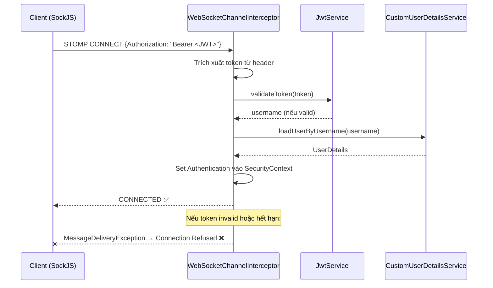
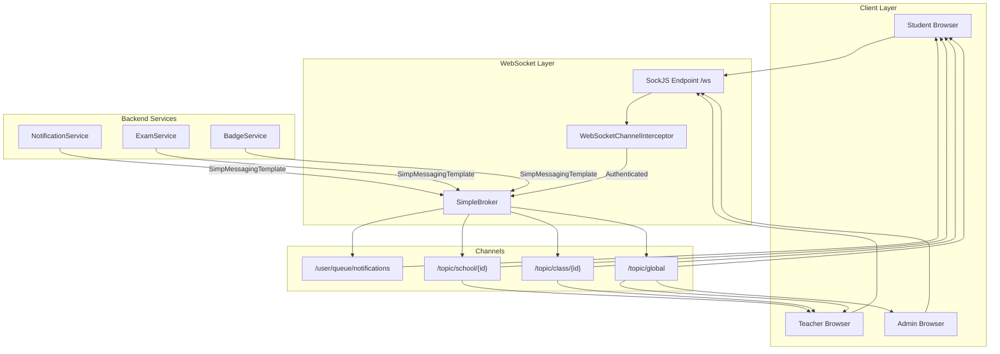

# 📡 EngAcademy LMS — WebSocket Events

> **Version:** 1.0  
> **Last Updated:** 2026-05-21  
> **Protocol:** STOMP over WebSocket (SockJS fallback)

---

## 1. Tổng Quan Kiến Trúc WebSocket

### 1.1. Cấu Hình Server

| Thông Số | Giá Trị |
|:---|:---|
| **Endpoint** | `ws://localhost:8080/ws` |
| **Transport** | WebSocket + SockJS fallback |
| **Protocol** | STOMP (Simple Text Oriented Messaging Protocol) |
| **Broker Prefixes** | `/topic` (broadcast), `/queue` (personal) |
| **App Destination Prefix** | `/app` |
| **User Destination Prefix** | `/user` |
| **Allowed Origins** | `http://localhost:3000`, `http://localhost:3001` |

### 1.2. Cấu Hình (WebSocketConfig.java)

```java
@Configuration
@EnableWebSocketMessageBroker
public class WebSocketConfig implements WebSocketMessageBrokerConfigurer {
    
    @Override
    public void configureMessageBroker(MessageBrokerRegistry config) {
        config.enableSimpleBroker("/topic", "/queue");   // Broker channels
        config.setApplicationDestinationPrefixes("/app");  // Client → Server
        config.setUserDestinationPrefix("/user");           // Per-user messages
    }
    
    @Override
    public void registerStompEndpoints(StompEndpointRegistry registry) {
        registry.addEndpoint("/ws")
                .setAllowedOriginPatterns(allowedOrigins.split(","))
                .withSockJS();  // Fallback cho browsers không hỗ trợ WS
    }
    
    @Override
    public void configureClientInboundChannel(ChannelRegistration registration) {
        registration.interceptors(webSocketChannelInterceptor); // JWT Auth
    }
}
```

---

## 2. Xác Thực WebSocket (JWT Authentication)

### 2.1. Luồng Xác Thực



### 2.2. Interceptor Implementation

```java
@Component
public class WebSocketChannelInterceptor implements ChannelInterceptor {
    
    @Override
    public Message<?> preSend(Message<?> message, MessageChannel channel) {
        StompHeaderAccessor accessor = StompHeaderAccessor.wrap(message);
        
        if (StompCommand.CONNECT.equals(accessor.getCommand())) {
            // Extract JWT from native headers
            String authHeader = accessor.getFirstNativeHeader("Authorization");
            
            if (authHeader != null && authHeader.startsWith("Bearer ")) {
                String token = authHeader.substring(7);
                String username = jwtService.extractUsername(token);
                
                if (username != null && jwtService.isTokenValid(token, ...)) {
                    UserDetails userDetails = userDetailsService.loadUserByUsername(username);
                    UsernamePasswordAuthenticationToken auth = 
                        new UsernamePasswordAuthenticationToken(userDetails, null, ...);
                    accessor.setUser(auth);
                }
            }
            
            if (accessor.getUser() == null) {
                throw new MessageDeliveryException("Unauthorized WebSocket connection");
            }
        }
        
        if (StompCommand.SUBSCRIBE.equals(accessor.getCommand())) {
            if (accessor.getUser() == null) {
                throw new MessageDeliveryException("Unauthorized subscription");
            }
        }
        
        return message;
    }
}
```

---

## 3. Channels & Events

### 3.1. Personal Channels (Per-User)

| Channel | Pattern | Mô Tả |
|:---|:---|:---|
| **Notifications** | `/user/queue/notifications` | Thông báo cá nhân |
| **Exam Updates** | `/user/queue/exam-updates` | Cập nhật trạng thái bài thi |

### 3.2. Broadcast Channels (Topic)

| Channel | Pattern | Mô Tả |
|:---|:---|:---|
| **School Broadcast** | `/topic/school/{schoolId}` | Thông báo toàn trường |
| **Class Broadcast** | `/topic/class/{classId}` | Thông báo theo lớp |
| **Global Broadcast** | `/topic/global` | Thông báo toàn hệ thống |
| **Leaderboard** | `/topic/leaderboard` | Cập nhật bảng xếp hạng |

---

## 4. Danh Sách Sự Kiện Chi Tiết

### 4.1. Notification Events

**Channel:** `/user/queue/notifications`

```json
{
  "type": "NOTIFICATION",
  "payload": {
    "id": 123,
    "title": "Bạn đã đạt badge mới!",
    "message": "Chúc mừng! Bạn đã nhận huy hiệu 'Streak Master' 🔥",
    "imageUrl": "/badges/streak-master.png",
    "isRead": false,
    "createdAt": "2026-05-21T10:30:00"
  }
}
```

**Trigger Scenarios:**
| Trigger | Mô Tả |
|:---|:---|
| Badge đạt được | Khi student đạt badge mới |
| Đề thi mới | Khi teacher công bố đề thi cho lớp |
| Điểm công bố | Khi teacher công bố điểm thi |
| Nhắc nhở ôn tập | Khi có flashcard quá hạn |
| Teacher gửi thông báo | Direct notification từ teacher |

### 4.2. Broadcast Events

**Channel:** `/topic/school/{schoolId}`

```json
{
  "type": "BROADCAST",
  "payload": {
    "title": "Thông báo quan trọng từ nhà trường",
    "message": "Lịch thi cuối kỳ đã được cập nhật...",
    "imageUrl": null,
    "targetType": "SCHOOL",
    "targetId": 1
  }
}
```

**Channel:** `/topic/class/{classId}`

```json
{
  "type": "CLASS_NOTIFICATION",
  "payload": {
    "title": "Có bài thi mới",
    "message": "Thầy đã tạo bài kiểm tra 'Unit 5 Test'. Deadline: 25/05/2026",
    "examId": 42
  }
}
```

---

## 5. Client-Side Implementation

### 5.1. Kết Nối WebSocket (React + SockJS + STOMP)

```typescript
import SockJS from 'sockjs-client';
import { Client, IMessage } from '@stomp/stompjs';

const connectWebSocket = (accessToken: string) => {
  const client = new Client({
    webSocketFactory: () => new SockJS('http://localhost:8080/ws'),
    
    connectHeaders: {
      Authorization: `Bearer ${accessToken}`,
    },
    
    onConnect: () => {
      console.log('WebSocket connected ✅');
      
      // Subscribe to personal notifications
      client.subscribe('/user/queue/notifications', (message: IMessage) => {
        const notification = JSON.parse(message.body);
        handleNotification(notification);
      });
      
      // Subscribe to school broadcasts
      client.subscribe(`/topic/school/${schoolId}`, (message: IMessage) => {
        const broadcast = JSON.parse(message.body);
        handleBroadcast(broadcast);
      });
    },
    
    onDisconnect: () => {
      console.log('WebSocket disconnected ❌');
    },
    
    onStompError: (frame) => {
      console.error('WebSocket error:', frame.headers.message);
    },
    
    reconnectDelay: 5000,  // Auto-reconnect sau 5 giây
  });
  
  client.activate();
  return client;
};
```

### 5.2. Gửi Message Từ Client

```typescript
// Gửi message đến server (ít dùng, chủ yếu dùng REST API)
client.publish({
  destination: '/app/some-endpoint',
  body: JSON.stringify({ data: 'value' }),
});
```

---

## 6. Server-Side Message Sending

### 6.1. Gửi Thông Báo Cá Nhân

```java
@Autowired
private SimpMessagingTemplate messagingTemplate;

// Gửi đến user cụ thể
public void sendNotification(Long userId, String title, String message) {
    NotificationPayload payload = new NotificationPayload(title, message);
    messagingTemplate.convertAndSendToUser(
        username,                          // STOMP user principal name
        "/queue/notifications",            // Destination
        payload
    );
}
```

### 6.2. Broadcast Đến Nhóm

```java
// Broadcast toàn trường
public void broadcastToSchool(Long schoolId, String title, String message) {
    BroadcastPayload payload = new BroadcastPayload(title, message);
    messagingTemplate.convertAndSend(
        "/topic/school/" + schoolId,
        payload
    );
}

// Broadcast theo lớp
public void notifyClass(Long classId, String title, String message) {
    ClassPayload payload = new ClassPayload(title, message);
    messagingTemplate.convertAndSend(
        "/topic/class/" + classId,
        payload
    );
}
```

---

## 7. Sơ Đồ Kiến Trúc



---

## 8. Security Rules

| Rule | Mô Tả |
|:---|:---|
| **CONNECT** | Phải có JWT hợp lệ trong header `Authorization` |
| **SUBSCRIBE** | Phải đã authenticated (có Principal) |
| **User Queue** | Spring tự động route `/user/queue/` đến đúng user |
| **Topic** | Client tự subscribe, server kiểm tra quyền khi send |
| **Token Expiry** | Khi JWT hết hạn, connection bị ngắt, client phải reconnect |

---

## 9. Error Handling

| Lỗi | Nguyên Nhân | Giải Pháp Client |
|:---|:---|:---|
| `MessageDeliveryException` | Token không hợp lệ | Refresh token rồi reconnect |
| Connection Lost | Server restart / Network | Auto-reconnect (5s delay) |
| Subscription Denied | Chưa authenticated | Connect lại với token mới |
