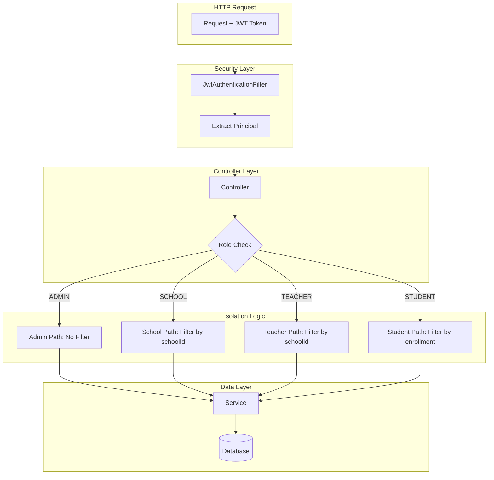

# 🏫 EngAcademy LMS — Multi-School Isolation Rules

> **Version:** 1.0  
> **Last Updated:** 2026-05-21

---

## 1. Tổng Quan Multi-School Architecture

EngAcademy LMS hỗ trợ mô hình **Multi-Tenant** (Multi-School) — nhiều trường học cùng sử dụng chung một hệ thống, nhưng dữ liệu của mỗi trường được **cách ly hoàn toàn**.

### Mô Hình Cách Ly:

```
┌─────────────────────────────────────────────────────┐
│                  EngAcademy Platform                 │
│  ┌─────────────────┐  ┌─────────────────┐          │
│  │   ADMIN (Global) │  │   System Config  │          │
│  └────────┬────────┘  └─────────────────┘          │
│           │                                          │
│  ┌────────┼──────────────────────────────────┐      │
│  │        ▼                                   │      │
│  │  ┌─────────────┐    ┌─────────────┐       │      │
│  │  │  School A    │    │  School B    │       │      │
│  │  │  ┌────────┐  │    │  ┌────────┐  │       │      │
│  │  │  │Teachers │  │    │  │Teachers │  │       │      │
│  │  │  │Students │  │    │  │Students │  │       │      │
│  │  │  │Classes  │  │    │  │Classes  │  │       │      │
│  │  │  │Exams    │  │    │  │Exams    │  │       │      │
│  │  │  └────────┘  │    │  └────────┘  │       │      │
│  │  └─────────────┘    └─────────────┘       │      │
│  │        ⛔ KHÔNG THỂ TRUY CẬP CHÉO ⛔       │      │
│  └────────────────────────────────────────────┘      │
└─────────────────────────────────────────────────────┘
```

---

## 2. Cơ Chế Cách Ly Dữ Liệu

### 2.1. Schema-Level (Database)

Dữ liệu được cách ly thông qua **Foreign Key `school_id`**:

| Entity | Cột School | Quan Hệ |
|:---|:---|:---|
| `USER` | `school_id` FK → SCHOOL.id | User thuộc trường |
| `CLASS` | `school_id` FK → SCHOOL.id, NOT NULL | Lớp thuộc trường |
| `EXAM` | Qua `class_id → CLASS.school_id` | Đề thi thuộc lớp → thuộc trường |
| `STUDENT_CLASS` | Qua `class_id → CLASS.school_id` | Đăng ký học → thuộc lớp → trường |

### 2.2. Application-Level (Controller/Service)

Mỗi controller kiểm tra `schoolId` của người dùng hiện tại trước khi trả dữ liệu:

```java
// Pattern chung trong tất cả Controllers
UserResponse currentUser = userService.getUserByUsername(userDetails.getUsername());

if (currentUser.getRoles().contains("ROLE_SCHOOL")) {
    // Kiểm tra schoolId
    if (currentUser.getSchoolId() == null || 
        !currentUser.getSchoolId().equals(targetResource.getSchoolId())) {
        return ResponseEntity.status(HttpStatus.FORBIDDEN)
            .body(ApiResponse.error("Bạn không có quyền truy cập dữ liệu trường khác"));
    }
}
```

---

## 3. Quy Tắc Cách Ly Theo Vai Trò

### 3.1. ROLE_ADMIN — Không Bị Cách Ly

| Hành Động | Scope | Ghi Chú |
|:---|:---|:---|
| Xem mọi trường | ✅ Tất cả | Toàn quyền |
| Xem mọi user | ✅ Tất cả | Không filter theo school |
| Xem mọi lớp | ✅ Tất cả | |
| Xem mọi đề thi | ✅ Tất cả | |
| Tạo trường mới | ✅ | |
| Tạo user cho bất kỳ trường | ✅ | |
| Xóa trường | ✅ (soft + hard delete) | |

### 3.2. ROLE_SCHOOL — Bị Cách Ly Chặt Nhất

| Hành Động | Scope | Cơ Chế |
|:---|:---|:---|
| Xem danh sách trường | 🔒 Chỉ trường mình | `getAllSchools()` → return `List.of(mySchool)` |
| Xem chi tiết trường | 🔒 Chỉ trường mình | `schoolId != currentUser.schoolId` → 403 |
| Cập nhật trường | 🔒 Chỉ trường mình | Check `currentUser.getSchool().getId().equals(id)` |
| Xem danh sách users | 🔒 Chỉ users trường mình | `userService.getAllUsersBySchool(schoolId, pageable)` |
| Tạo user mới | 🔒 Auto-set schoolId | `request.setSchoolId(currentUser.getSchoolId())` |
| Xem/Xóa user | 🔒 Chỉ users trường mình | `targetUser.schoolId == currentUser.schoolId` |
| Xem lớp học | 🔒 Chỉ lớp trường mình | `classRoomService.getClassRoomsBySchool(schoolId)` |
| Tạo lớp | 🔒 Auto-set schoolId | |
| Xem đề thi | 🔒 Chỉ đề thi trường mình | `exam.schoolId == currentUser.schoolId` |
| Xem kết quả thi | 🔒 Chỉ kết quả trường mình | Check exam's schoolId |
| Tìm giáo viên | 🔒 Chỉ GV trường mình | `searchTeachers(keyword, schoolId)` |
| Tìm học sinh | 🔒 Chỉ HS trường mình | `searchStudents(keyword, schoolId)` |

### 3.3. ROLE_TEACHER — Cách Ly Một Phần

| Hành Động | Scope | Cơ Chế |
|:---|:---|:---|
| Xem lớp học | 🔒 Chỉ lớp trường mình | Filter theo schoolId |
| Xem đề thi theo lớp | 🔒 Chỉ lớp trường mình | Check classRoom.schoolId |
| Tạo nội dung (bài học, từ vựng) | ✅ Không giới hạn trường | Nội dung là global |
| Xem tiến độ học sinh | ⚠️ Bất kỳ user | Cần cải thiện scope |

### 3.4. ROLE_STUDENT — Cách Ly Theo Enrollment

| Hành Động | Scope | Cơ Chế |
|:---|:---|:---|
| Xem đề thi lớp | 🔒 Chỉ lớp mình tham gia | `isStudentEnrolledInClass(userId, classId)` |
| Nộp bài thi | 🔒 Chỉ cho chính mình | `studentId == authenticatedUserId` |
| Xem kết quả thi | 🔒 Chỉ kết quả mình | `getStudentExamResult(examId, currentUserId)` |
| Cập nhật profile | 🔒 Chỉ của mình | Tự động lấy từ JWT |

---

## 4. Chi Tiết Implementation Theo Controller

### 4.1. SchoolController Isolation

```java
// GET /api/v1/schools — Danh sách trường
if (currentUser.getRoles().contains("ROLE_SCHOOL")) {
    SchoolResponse mySchool = schoolService.getSchoolById(currentUser.getSchoolId());
    return List.of(mySchool);  // CHỈ trả về trường mình
}
return schoolService.getAllSchools();  // ADMIN: trả tất cả

// GET /api/v1/schools/{id} — Chi tiết trường
if (currentUser.getRoles().contains("ROLE_SCHOOL")) {
    if (!currentUser.getSchoolId().equals(id)) {
        return 403 FORBIDDEN;  // Chặn xem trường khác
    }
}
```

### 4.2. UserController Isolation

```java
// GET /api/v1/users — Danh sách users
if (currentUser.getRoles().contains("ROLE_SCHOOL")) {
    return userService.getAllUsersBySchool(currentUser.getSchoolId(), pageable);
    // SQL: WHERE school_id = ?
}
return userService.getAllUsers(pageable);  // ADMIN: tất cả

// POST /api/v1/users — Tạo user
if (currentUser.getRoles().contains("ROLE_SCHOOL")) {
    request.setSchoolId(currentUser.getSchoolId());  // Force gán schoolId
}
```

### 4.3. ClassRoomController Isolation

```java
// GET /api/v1/classes — Danh sách lớp
if (currentUser.getRoles().contains("ROLE_SCHOOL")) {
    return classRoomService.getClassRoomsBySchool(currentUser.getSchoolId());
    // SQL: WHERE school_id = ?
}

// GET /api/v1/classes/school/{schoolId} — Lớp theo trường
if (currentUser.getRoles().contains("ROLE_SCHOOL")) {
    if (!currentUser.getSchoolId().equals(schoolId)) {
        return 403 FORBIDDEN;
    }
}
```

### 4.4. ExamController Isolation

```java
// GET /api/v1/exams — Danh sách đề thi
if (currentUser.getRoles().contains("ROLE_SCHOOL")) {
    return examService.getExamsBySchool(currentUser.getSchoolId(), pageable);
}

// GET /api/v1/exams/class/{classId} — Đề thi theo lớp
if (currentUser.getRoles().contains("ROLE_STUDENT")) {
    boolean isEnrolled = classRoomService.isStudentEnrolledInClass(currentUser.getId(), classId);
    if (!isEnrolled) return 403;  // Student phải thuộc lớp
}
if (currentUser.getRoles().contains("ROLE_SCHOOL") || currentUser.getRoles().contains("ROLE_TEACHER")) {
    ClassRoomResponse classRoom = classRoomService.getClassRoomById(classId);
    if (!currentUser.getSchoolId().equals(classRoom.getSchoolId())) return 403;
}
```

---

## 5. Data Flow Isolation Diagram



---

## 6. Bảng Quy Tắc Cách Ly Nhanh

| Resource | Admin Sees | School Sees | Teacher Sees | Student Sees |
|:---|:---:|:---:|:---:|:---:|
| Schools | All | Own only | — | — |
| Users | All | Own school | — | — |
| Classes | All | Own school | Own school | Enrolled classes |
| Exams | All | Own school | Own school | Enrolled classes |
| Exam Results | All | Own school | Own classes | Own results |
| Lessons | All | All | All | Published |
| Vocabulary | All | — | All | All |
| Notifications | Own | Own | Own | Own |
| Leaderboard | All + school filter | All + school filter | All + school filter | All + school filter |
| Badges | Via user lookup | — | Via user lookup | Own only |

---

## 7. Lỗ Hổng Đã Biết & Cải Tiến Cần Thiết

### 7.1. Đã Fix (Security Hardening)

| ID | Mô Tả | Status |
|:---|:---|:---|
| BUG-003 | Student xem đề thi lớp khác (thiếu enrollment check) | ✅ Fixed |
| BUG-002/004 | IDOR trên một số endpoints | ✅ Fixed |

### 7.2. Cần Cải Thiện

| ID | Mô Tả | Rủi Ro |
|:---|:---|:---|
| ISO-001 | Teacher xem tiến độ học sinh bất kỳ (không giới hạn trường) | 🔶 Trung bình |
| ISO-002 | Leaderboard endpoint `/leaderboard/coins` không bắt buộc schoolId filter | 🔷 Thấp |
| ISO-003 | `getActiveExams()` không validate enrollment | 🔶 Trung bình |
| ISO-004 | Anti-cheat events cho SCHOOL role chưa check school boundary triệt để | 🔷 Thấp |

---

## 8. Best Practices Cho Lập Trình Viên

### ✅ DO (Nên làm)

1. **Luôn kiểm tra `schoolId`** khi xử lý request từ ROLE_SCHOOL
2. **Luôn kiểm tra enrollment** khi xử lý request từ ROLE_STUDENT
3. **Sử dụng `@AuthenticationPrincipal`** để lấy user từ JWT, KHÔNG tin tưởng request params
4. **Auto-set schoolId** khi SCHOOL tạo resource mới
5. **Return 403** thay vì 404 khi bị chặn bởi isolation — để tránh tiết lộ sự tồn tại của resource

### ❌ DON'T (Không nên)

1. **KHÔNG tin tưởng** `userId` hoặc `schoolId` từ request body/params khi có thể lấy từ JWT
2. **KHÔNG dùng** `getAllXxx()` mà không filter theo school cho ROLE_SCHOOL
3. **KHÔNG trả 404** cho resource thuộc trường khác — hãy trả 403
4. **KHÔNG bỏ qua** kiểm tra enrollment cho student endpoints

---

## 9. Tóm Tắt Logic Cách Ly

```
IF (role == ADMIN):
    → Trả tất cả dữ liệu, không filter

IF (role == SCHOOL):
    → Filter TẤT CẢ query theo currentUser.schoolId
    → Auto-set schoolId khi tạo resource
    → Chặn truy cập resource có schoolId ≠ currentUser.schoolId

IF (role == TEACHER):
    → Filter classes/exams theo schoolId
    → Nội dung (lessons, vocab) là global

IF (role == STUDENT):
    → Chỉ truy cập resource qua enrollment
    → Chỉ thao tác trên dữ liệu của chính mình
    → userId luôn lấy từ JWT, không nhận từ client
```
