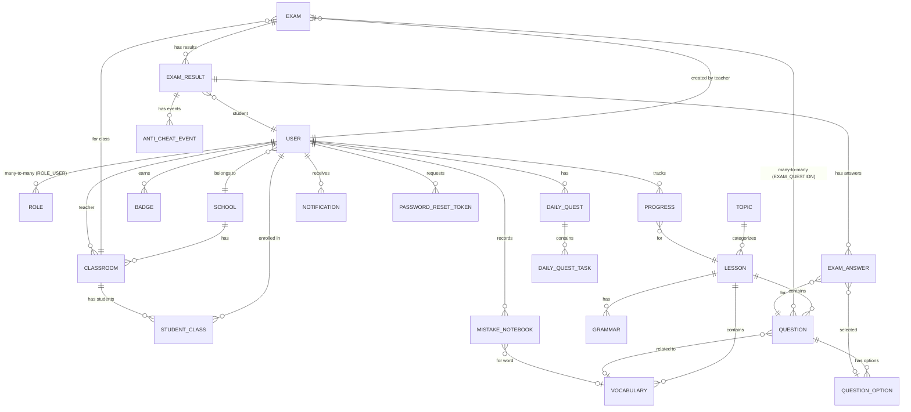

# WebLearnEnglish — Complete Technical Documentation

---

## 1. System Overview

**WebLearnEnglish** is a full-stack English learning platform designed for **schools, teachers, and students**. It provides features for vocabulary/lesson management, exam creation with anti-cheat capabilities, gamification (badges, daily quests, leaderboards, coins, streaks), and real-time notifications.

The project consists of **three separate codebases**:

| Codebase | Role | Port |
|----------|------|------|
| **BackEnd** | REST API server (Spring Boot) | `8080` |
| **FrontEnd** | Student & Teacher UI (React) | `3000` |
| **Admin** | Admin & School management panel (React) | `3001` |

---

## 2. Architecture

### 2.1 Overall Pattern: **Clean Architecture (Monolithic Backend + Multi-Frontend SPA)**

```
┌─────────────────────────────────────────────────────────────────┐
│                      Client Applications                        │
│  ┌──────────────┐  ┌──────────────┐  ┌───────────────────────┐  │
│  │  FrontEnd    │  │   Admin      │  │  Swagger UI           │  │
│  │  (React)     │  │   (React)    │  │  (OpenAPI)            │  │
│  │  Port: 3000  │  │   Port: 3001 │  │  /swagger-ui.html     │  │
│  └──────┬───────┘  └──────┬───────┘  └───────────┬───────────┘  │
│         │                 │                      │              │
│         └─────────────────┼──────────────────────┘              │
│                           │ HTTP REST / WebSocket               │
├───────────────────────────┼─────────────────────────────────────┤
│                    BackEnd (Spring Boot :8080)                   │
│  ┌────────────────────────────────────────────────────────────┐  │
│  │ Presentation Layer    (Controllers)                        │  │
│  ├────────────────────────────────────────────────────────────┤  │
│  │ Application Layer     (Services, DTOs)                     │  │
│  ├────────────────────────────────────────────────────────────┤  │
│  │ Domain Layer          (Entities, Exceptions)               │  │
│  ├────────────────────────────────────────────────────────────┤  │
│  │ Infrastructure Layer  (Repositories, Security, Config)     │  │
│  └────────────────────────────────────────────────────────────┘  │
├─────────────────────────────────────────────────────────────────┤
│                      Data Stores                                │
│  ┌──────────────────┐                                           │
│  │  MySQL            │  Database: english_learning              │
│  │  localhost:3306   │                                          │
│  └──────────────────┘                                           │
└─────────────────────────────────────────────────────────────────┘
```

### 2.2 Backend Layers

```
com.englishlearn
├── EnglishLearnApplication.java    ← Entry point (@SpringBootApplication)
├── domain/
│   ├── entity/                     ← 22 JPA entity classes
│   └── exception/                  ← Custom exceptions (ApiException, ResourceNotFoundException, etc.)
├── application/
│   ├── dto/
│   │   ├── request/                ← Request DTOs with Jakarta validation
│   │   └── response/               ← Response DTOs (ApiResponse wrapper, entity-specific)
│   └── service/                    ← 15 business logic services
├── infrastructure/
│   ├── config/                     ← SecurityConfig, WebSocketConfig, OpenApiConfig, GlobalExceptionHandler, DataInitializer, DevDataSeeder
│   ├── persistence/                ← 21 Spring Data JPA repository interfaces
│   └── security/                   ← JwtService, JwtAuthFilter, RateLimitFilter, CustomUserDetailsService, CustomAccessDeniedHandler, CustomAuthenticationEntryPoint
└── presentation/
    └── controller/                 ← 17 REST controllers
```

---

## 3. Technology Stack

### 3.1 BackEnd

| Component | Technology |
|-----------|-----------|
| Framework | Spring Boot 3.x |
| Language | Java (Jakarta EE) |
| ORM | Spring Data JPA / Hibernate |
| Database | MySQL 8.x (`english_learning`) |
| Authentication | JWT (jjwt library) with access + refresh tokens |
| Password Encoding | BCrypt |
| API Documentation | Swagger/OpenAPI 3 (springdoc) |
| Email | Spring Mail (SMTP Gmail) |
| WebSocket | Spring WebSocket + STOMP over SockJS |
| Build Tool | Maven (implied by standard Spring Boot structure) |
| Validation | Jakarta Bean Validation |
| Utilities | Lombok |

### 3.2 FrontEnd (Student & Teacher UI)

| Component | Technology |
|-----------|-----------|
| Build Tool | Vite |
| UI Framework | React + TypeScript |
| Routing | React Router |
| Styling | Tailwind CSS |
| State Management | Zustand (4 stores: auth, theme, toast, ui) |
| HTTP Client | Axios (with interceptors for JWT) |

### 3.3 Admin Panel

| Component | Technology |
|-----------|-----------|
| Build Tool | Vite |
| UI Framework | React + TypeScript |
| Component Library | shadcn/ui |
| Styling | Tailwind CSS |
| State Management | Redux Toolkit (RTK) |
| Routing | React Router |
| Notifications | Sonner toast library |

---

## 4. System Features

### 4.1 Authentication & Authorization
- JWT-based auth with access token (24h) + refresh token (7 days)
- Role-based access control: `ROLE_ADMIN`, `ROLE_SCHOOL`, `ROLE_TEACHER`, `ROLE_STUDENT`
- Password reset via OTP email
- Rate limiting on login/register endpoints (10 attempts / 60s per IP)
- Method-level security via `@PreAuthorize`

### 4.2 User Management
- Registration, login, profile update, password change
- Coin system (gamification currency)
- Streak tracking
- School-scoped user access (School role sees only its own users)

### 4.3 School & Classroom Management
- CRUD operations for schools (with soft delete + hard delete)
- Classroom creation, teacher assignment, student enrollment
- Academic year tracking
- School-scoped data isolation

### 4.4 Lesson & Content Management
- Lessons with HTML content, grammar explanations, audio/video URLs
- Topic categorization, difficulty levels, order indexing
- Publish/unpublish workflow
- Vocabulary per lesson with word, pronunciation, meaning, example, image, audio

### 4.5 Question & Exam System
- Question types: `MULTIPLE_CHOICE`, `FILL_IN_BLANK`, `TRUE_FALSE`, `ESSAY`
- Question options with correct answer flagging
- Exams with shuffle questions/answers, timed duration, status lifecycle (`DRAFT → PUBLISHED → CLOSED`)
- **Anti-cheat system**: tab switch detection, copy/paste monitoring, dev tools detection, blur events
- Exam result scoring with violation count tracking
- Score publishing workflow (teacher controls when students see results)

### 4.6 Progress Tracking
- Per-user, per-lesson progress tracking (completion percentage)
- Completed/in-progress lesson lists
- Learning statistics (completed count, average progress)

### 4.7 Gamification
- **Badges**: Achievement system with auto-award capabilities
- **Daily Quests**: Task types: `LEARN_VOCAB`, `COMPLETE_LESSON`, `SCORE_EXAM`
- **Leaderboard**: Rankings by coins, streaks, and global composite scoring
- **Coins**: Virtual currency earned through activities

### 4.8 Mistake Notebook
- Records vocabulary mistakes with incrementing count
- Top-10 most-mistaken words
- Delete/remove functionality for reviewed mistakes

### 4.9 Notifications (Real-time)
- WebSocket via STOMP over SockJS endpoint `/ws`
- Message broker: `/topic` (broadcast), `/queue` (point-to-point), `/user` (user-specific)
- Notification persistence in database (read/unread tracking)

### 4.10 Email Service
- SMTP Gmail integration for OTP-based password reset
- 6-character OTP codes with expiration

---

## 5. Domain Entities (Database Schema)

### 5.1 Entity Relationship Summary



### 5.2 Entity Details

| # | Entity | Table | Key Fields | Purpose |
|---|--------|-------|------------|---------|
| 1 | [User](file:///d:/DaiHoc/J2EJava/weblearnenglish/BackEnd/src/main/java/com/englishlearn/domain/entity/User.java#10-79) | `USERS` | id, username, email, passwordHash, fullName, dateOfBirth, avatarUrl, coins, streakDays, isActive, schoolId | Core user account |
| 2 | [Role](file:///d:/DaiHoc/J2EJava/weblearnenglish/BackEnd/src/main/java/com/englishlearn/domain/entity/Role.java#6-31) | `ROLE` | id, name, description | Roles: ADMIN, SCHOOL, TEACHER, STUDENT |
| 3 | [School](file:///d:/DaiHoc/J2EJava/weblearnenglish/BackEnd/src/main/java/com/englishlearn/domain/entity/School.java#8-48) | `SCHOOL` | id, name, address, phone, email, isActive, trialEndDate | Educational institution |
| 4 | [ClassRoom](file:///d:/DaiHoc/J2EJava/weblearnenglish/BackEnd/src/main/java/com/englishlearn/domain/entity/ClassRoom.java#6-37) | `CLASS` | id, name, schoolId, teacherId, academicYear, isActive | Class within a school |
| 5 | [StudentClass](file:///d:/DaiHoc/J2EJava/weblearnenglish/BackEnd/src/main/java/com/englishlearn/domain/entity/StudentClass.java#7-39) | `STUDENT_CLASS` | id, studentId, classId, joinedAt, status | Student-class enrollment |
| 6 | [Topic](file:///d:/DaiHoc/J2EJava/weblearnenglish/BackEnd/src/main/java/com/englishlearn/domain/entity/Topic.java#6-25) | `TOPIC` | id, name, description | Lesson categorization |
| 7 | [Lesson](file:///d:/DaiHoc/J2EJava/weblearnenglish/BackEnd/src/main/java/com/englishlearn/domain/entity/Lesson.java#9-59) | `LESSON` | id, title, topicId, contentHtml, grammarHtml, audioUrl, videoUrl, difficultyLevel, orderIndex, isPublished | Learning lesson |
| 8 | [Vocabulary](file:///d:/DaiHoc/J2EJava/weblearnenglish/BackEnd/src/main/java/com/englishlearn/domain/entity/Vocabulary.java#6-41) | `VOCABULARY` | id, lessonId, word, pronunciation, meaning, exampleSentence, imageUrl, audioUrl | Vocabulary item |
| 9 | [Grammar](file:///d:/DaiHoc/J2EJava/weblearnenglish/BackEnd/src/main/java/com/englishlearn/domain/entity/Grammar.java#6-32) | `GRAMMAR` | id, lessonId, title, explanation, example | Grammar rule |
| 10 | [Question](file:///d:/DaiHoc/J2EJava/weblearnenglish/BackEnd/src/main/java/com/englishlearn/domain/entity/Question.java#6-40) | `QUESTION` | id, lessonId, vocabularyId, questionType, questionText, points, explanation | Assessment question |
| 11 | [QuestionOption](file:///d:/DaiHoc/J2EJava/weblearnenglish/BackEnd/src/main/java/com/englishlearn/domain/entity/QuestionOption.java#6-30) | `QUESTION_OPTION` | id, questionId, optionText, isCorrect | MCQ answer option |
| 12 | [Exam](file:///d:/DaiHoc/J2EJava/weblearnenglish/BackEnd/src/main/java/com/englishlearn/domain/entity/Exam.java#9-67) | `EXAM` | id, title, teacherId, classId, startTime, endTime, durationMinutes, shuffleQuestions, shuffleAnswers, antiCheatEnabled, status, scorePublished | Exam definition |
| 13 | [ExamResult](file:///d:/DaiHoc/J2EJava/weblearnenglish/BackEnd/src/main/java/com/englishlearn/domain/entity/ExamResult.java#8-50) | `EXAM_RESULT` | id, examId, studentId, score, correctCount, totalQuestions, submittedAt, violationCount | Student's exam result |
| 14 | [ExamAnswer](file:///d:/DaiHoc/J2EJava/weblearnenglish/BackEnd/src/main/java/com/englishlearn/domain/entity/ExamAnswer.java#6-34) | `EXAM_ANSWER` | id, examResultId, questionId, selectedOptionId, isCorrect | Individual question answer |
| 15 | [AntiCheatEvent](file:///d:/DaiHoc/J2EJava/weblearnenglish/BackEnd/src/main/java/com/englishlearn/domain/entity/AntiCheatEvent.java#11-45) | `ANTI_CHEAT_EVENT` | id, examResultId, eventType, eventTime, details | Anti-cheat violation log |
| 16 | [Progress](file:///d:/DaiHoc/J2EJava/weblearnenglish/BackEnd/src/main/java/com/englishlearn/domain/entity/Progress.java#7-45) | `PROGRESS` | id, userId, lessonId, completionPercentage, lastAccessed, isCompleted | Lesson progress tracker |
| 17 | [DailyQuest](file:///d:/DaiHoc/J2EJava/weblearnenglish/BackEnd/src/main/java/com/englishlearn/domain/entity/DailyQuest.java#9-37) | `DAILY_QUEST` | id, userId, questDate, isCompleted | Daily quest container |
| 18 | [DailyQuestTask](file:///d:/DaiHoc/J2EJava/weblearnenglish/BackEnd/src/main/java/com/englishlearn/domain/entity/DailyQuestTask.java#6-37) | `DAILY_QUEST_TASK` | id, dailyQuestId, taskType, targetCount, currentCount, isCompleted | Individual quest task |
| 19 | [Badge](file:///d:/DaiHoc/J2EJava/weblearnenglish/BackEnd/src/main/java/com/englishlearn/domain/entity/Badge.java#7-41) | `BADGE` | id, userId, name, description, iconUrl, earnedAt | Achievement badge |
| 20 | [MistakeNotebook](file:///d:/DaiHoc/J2EJava/weblearnenglish/BackEnd/src/main/java/com/englishlearn/domain/entity/MistakeNotebook.java#7-43) | `MISTAKE_NOTEBOOK` | id, userId, vocabularyId, mistakeCount, userRecordingUrl, addedAt | Vocabulary mistake record |
| 21 | [Notification](file:///d:/DaiHoc/J2EJava/weblearnenglish/BackEnd/src/main/java/com/englishlearn/domain/entity/Notification.java#7-42) | `NOTIFICATION` | id, userId, title, message, isRead, createdAt | User notification |
| 22 | [PasswordResetToken](file:///d:/DaiHoc/J2EJava/weblearnenglish/BackEnd/src/main/java/com/englishlearn/domain/entity/PasswordResetToken.java#8-39) | `password_reset_tokens` | id, userId, otp, expiredAt, used, createdAt | OTP for password reset |

---

## 6. API Endpoints (Complete)

All endpoints are prefixed with `/api/v1`. Standard response wrapper:
```json
{ "success": true, "message": "...", "data": {}, "timestamp": "..." }
```

### 6.1 Authentication (`/api/v1/auth`) → [AuthController](file:///d:/DaiHoc/J2EJava/weblearnenglish/BackEnd/src/main/java/com/englishlearn/presentation/controller/AuthController.java#29-120) → `AuthService`

| Method | Endpoint | Auth | Purpose |
|--------|----------|------|---------|
| POST | `/auth/register` | Public | Register new account |
| POST | `/auth/login` | Public | Login, returns JWT tokens |
| POST | `/auth/refresh-token` | Public | Refresh access token |
| POST | `/auth/logout` | Public | Logout (stateless, client-side) |
| GET | `/auth/health` | Public | Server health check |
| POST | `/auth/forgot-password` | Public | Send OTP email for password reset |
| POST | `/auth/reset-password` | Public | Reset password using OTP |

### 6.2 User Management (`/api/v1/users`) → [UserController](file:///d:/DaiHoc/J2EJava/weblearnenglish/BackEnd/src/main/java/com/englishlearn/presentation/controller/UserController.java#32-180) → `UserService`

| Method | Endpoint | Auth | Purpose |
|--------|----------|------|---------|
| GET | `/users/me` | Authenticated | Get current user info |
| GET | `/users/{id}` | ADMIN, SCHOOL | Get user by ID |
| GET | `/users` | ADMIN, SCHOOL | List all users (paginated, school-scoped) |
| POST | `/users` | ADMIN, SCHOOL | Create new user |
| DELETE | `/users/{id}` | ADMIN, SCHOOL | Delete user |
| PATCH | `/users/me` | Authenticated | Update profile (fullName, avatarUrl) |
| POST | `/users/{id}/coins` | ADMIN, TEACHER | Add coins to user |
| GET | `/users/students` | ADMIN, SCHOOL, TEACHER | Search students by keyword |
| PATCH | `/users/me/password` | Authenticated | Change password |

### 6.3 School Management (`/api/v1/schools`) → `SchoolController` → `SchoolService`

| Method | Endpoint | Auth | Purpose |
|--------|----------|------|---------|
| GET | `/schools` | ADMIN, SCHOOL | List all schools |
| GET | `/schools/active` | ADMIN, SCHOOL | List active schools (paginated) |
| GET | `/schools/{id}` | ADMIN, SCHOOL | Get school details |
| GET | `/schools/search?name=` | ADMIN, SCHOOL | Search schools by name |
| POST | `/schools` | ADMIN | Create school |
| PUT | `/schools/{id}` | ADMIN, SCHOOL | Update school (school-scoped) |
| DELETE | `/schools/{id}` | ADMIN | Soft delete school |
| DELETE | `/schools/{id}/permanent` | ADMIN | Hard delete school |

### 6.4 Classroom Management (`/api/v1/classes`) → `ClassRoomController` → `ClassRoomService`

| Method | Endpoint | Auth | Purpose |
|--------|----------|------|---------|
| GET | `/classes` | ADMIN, SCHOOL, TEACHER | List all classrooms |
| GET | `/classes/school/{schoolId}` | ADMIN, SCHOOL, TEACHER | List classes by school (paginated) |
| GET | `/classes/teacher/{teacherId}` | ADMIN, SCHOOL, TEACHER | List classes by teacher |
| GET | `/classes/student/{studentId}` | ADMIN+, STUDENT (own) | List classes by student |
| GET | `/classes/{id}` | ADMIN+ | Get classroom by ID |
| POST | `/classes` | ADMIN, SCHOOL | Create classroom |
| PUT | `/classes/{id}` | ADMIN, SCHOOL | Update classroom |
| POST | `/classes/{classId}/teacher/{teacherId}` | ADMIN, SCHOOL | Assign teacher to class |
| POST | `/classes/{classId}/students/{studentId}` | ADMIN, SCHOOL, TEACHER | Add student to class |
| DELETE | `/classes/{classId}/students/{studentId}` | ADMIN, SCHOOL, TEACHER | Remove student from class |
| GET | `/classes/{classId}/students` | ADMIN, SCHOOL, TEACHER | Get students in class |
| GET | `/classes/{classId}/students/search?keyword=` | ADMIN, SCHOOL, TEACHER | Search students for class |
| DELETE | `/classes/{id}` | ADMIN, SCHOOL | Soft delete classroom |

### 6.5 Lesson Management (`/api/v1/lessons`) → `LessonController` → `LessonService`

| Method | Endpoint | Auth | Purpose |
|--------|----------|------|---------|
| GET | `/lessons/{id}` | Authenticated | Get lesson by ID |
| GET | `/lessons` | Authenticated | List all lessons (paginated) |
| GET | `/lessons?published=true` | Authenticated | List published lessons |
| POST | `/lessons` | ADMIN, TEACHER | Create lesson |
| PUT | `/lessons/{id}` | ADMIN, TEACHER | Update lesson |
| DELETE | `/lessons/{id}` | ADMIN | Delete lesson |

### 6.6 Vocabulary (`/api/v1/vocabulary`) → `VocabularyController` → `VocabularyService`

| Method | Endpoint | Auth | Purpose |
|--------|----------|------|---------|
| GET | `/vocabulary/lesson/{lessonId}` | ADMIN, TEACHER, STUDENT | Get vocabulary by lesson |
| GET | `/vocabulary/lesson/{lessonId}/paged` | ADMIN, TEACHER, STUDENT | Paginated vocabulary |
| GET | `/vocabulary/topic/{topicId}` | ADMIN, TEACHER, STUDENT | Get vocabulary by topic |
| GET | `/vocabulary/{id}` | ADMIN, TEACHER, STUDENT | Get vocabulary by ID |
| GET | `/vocabulary/search?keyword=` | ADMIN, TEACHER, STUDENT | Search vocabulary |
| GET | `/vocabulary/flashcards/{lessonId}?count=` | STUDENT, TEACHER | Get flashcards for lesson |
| GET | `/vocabulary/flashcards/random?count=` | STUDENT, TEACHER | Get random flashcards |
| POST | `/vocabulary` | ADMIN, TEACHER | Create vocabulary |
| PUT | `/vocabulary/{id}` | ADMIN, TEACHER | Update vocabulary |
| DELETE | `/vocabulary/{id}` | ADMIN, TEACHER | Delete vocabulary |

### 6.7 Question Management (`/api/v1/questions`) → `QuestionController` → `QuestionService`

| Method | Endpoint | Auth | Purpose |
|--------|----------|------|---------|
| GET | `/questions` | ADMIN, TEACHER | List all questions |
| GET | `/questions/type/{type}` | ADMIN, TEACHER | Get by type (paginated) |
| GET | `/questions/lesson/{lessonId}` | ADMIN, TEACHER, STUDENT | Get by lesson |
| GET | `/questions/{id}` | ADMIN, TEACHER, STUDENT | Get by ID |
| POST | `/questions` | ADMIN, TEACHER | Create question |
| PUT | `/questions/{id}` | ADMIN, TEACHER | Update question |
| DELETE | `/questions/{id}` | ADMIN, TEACHER | Delete question |

### 6.8 Exam Management (`/api/v1/exams`) → `ExamController` → `ExamService`

| Method | Endpoint | Auth | Purpose |
|--------|----------|------|---------|
| GET | `/exams/teacher/{teacherId}` | ADMIN, SCHOOL, TEACHER | Get exams by teacher |
| GET | `/exams/class/{classId}` | ADMIN+ | Get exams by class |
| GET | `/exams/class/{classId}/active` | TEACHER, STUDENT | Get active exams |
| GET | `/exams/{id}` | ADMIN, SCHOOL, TEACHER | Get exam (teacher view, shows answers) |
| GET | `/exams/{id}/take` | STUDENT | Get exam for taking (shuffled, no answers) |
| POST | `/exams?teacherId=` | ADMIN, TEACHER | Create exam |
| PUT | `/exams/{id}` | ADMIN, TEACHER | Update exam |
| POST | `/exams/{id}/publish` | ADMIN, TEACHER | Publish exam |
| POST | `/exams/{id}/close` | ADMIN, TEACHER | Close exam |
| POST | `/exams/{id}/publish-scores` | ADMIN, TEACHER | Publish exam scores |
| POST | `/exams/submit?studentId=` | STUDENT | Submit exam answers |
| GET | `/exams/{id}/results` | ADMIN, SCHOOL, TEACHER | Get all exam results |
| GET | `/exams/{id}/my-result` | STUDENT | Get own exam result |
| DELETE | `/exams/{id}` | ADMIN, TEACHER | Delete exam |
| POST | `/exams/{examId}/start?studentId=` | STUDENT | Start exam (create session) |
| POST | `/exams/{examId}/anti-cheat-event` | STUDENT | Log anti-cheat event |
| POST | `/exams/{examId}/submit-anticheat` | STUDENT | Submit with anti-cheat validation |
| GET | `/exams/results/{examResultId}/anti-cheat-events` | TEACHER, ADMIN | Get cheat event history |

### 6.9 Progress Tracking (`/api/v1/progress`) → `ProgressController` → `ProgressService`

| Method | Endpoint | Auth | Purpose |
|--------|----------|------|---------|
| GET | `/progress/user/{userId}` | ADMIN, TEACHER, STUDENT | All progress for user |
| GET | `/progress/user/{userId}/completed` | ADMIN, TEACHER, STUDENT | Completed lessons |
| GET | `/progress/user/{userId}/in-progress` | ADMIN, TEACHER, STUDENT | In-progress lessons |
| GET | `/progress/user/{userId}/lesson/{lessonId}` | ADMIN, TEACHER, STUDENT | Progress for specific lesson |
| POST | `/progress/user/{userId}/lesson/{lessonId}?percentage=` | STUDENT | Update progress |
| POST | `/progress/user/{userId}/lesson/{lessonId}/complete` | STUDENT | Mark lesson complete |
| GET | `/progress/user/{userId}/stats` | ADMIN, TEACHER, STUDENT | Learning statistics |

### 6.10 Badges (`/api/v1/badges`) → `BadgeController` → `BadgeService`

| Method | Endpoint | Auth | Purpose |
|--------|----------|------|---------|
| GET | `/badges/me` | Authenticated | Get my badges |
| GET | `/badges/users/{userId}` | Public | Get user's badges |
| GET | `/badges/{badgeId}` | Public | Get badge by ID |
| POST | `/badges` | Authenticated | Create badge |
| POST | `/badges/{userId}/award/{badgeName}` | ADMIN, TEACHER | Award badge to user |
| DELETE | `/badges/{badgeId}` | Authenticated | Delete own badge |
| GET | `/badges/users/{userId}/count` | Public | Count user's badges |
| POST | `/badges/{userId}/check-achievements` | ADMIN, SYSTEM | Auto-check and award badges |

### 6.11 Daily Quests (`/api/v1/quests`) → `DailyQuestController` → `DailyQuestService`

| Method | Endpoint | Auth | Purpose |
|--------|----------|------|---------|
| GET | `/quests/today` | Authenticated | Get/create today's quest |
| POST | `/quests` | Authenticated | Create quest with custom tasks |
| PATCH | `/quests/tasks/{taskId}?progress=` | Authenticated | Update task progress |
| POST | `/quests/complete` | Authenticated | Complete today's quest |
| GET | `/quests/history` | Authenticated | Get quest history |

### 6.12 Leaderboard (`/api/v1/leaderboard`) → `LeaderboardController` → `LeaderboardService`

| Method | Endpoint | Auth | Purpose |
|--------|----------|------|---------|
| GET | `/leaderboard/coins` | Public | Leaderboard by coins (paginated) |
| GET | `/leaderboard/streak?limit=` | Public | Leaderboard by streak |
| GET | `/leaderboard/global?limit=` | Public | Global composite leaderboard |
| GET | `/leaderboard/top?limit=` | Public | Top users by coins |
| GET | `/leaderboard/me` | Authenticated | My rank |
| GET | `/leaderboard/users/{userId}` | Public | User's rank |
| GET | `/leaderboard/around-me?rangeSize=` | Authenticated | Ranks around me |
| GET | `/leaderboard/around-user/{userId}?rangeSize=` | Public | Ranks around user |
| GET | `/leaderboard/compare?userIds=` | Public | Compare multiple users |

### 6.13 Mistake Notebook (`/api/v1/mistakes`) → `MistakeNotebookController` → `MistakeNotebookService`

| Method | Endpoint | Auth | Purpose |
|--------|----------|------|---------|
| GET | `/mistakes/user/{userId}` | STUDENT, TEACHER, ADMIN | Get user's mistakes |
| GET | `/mistakes/user/{userId}/top` | STUDENT, TEACHER, ADMIN | Top 10 mistakes |
| GET | `/mistakes/user/{userId}/count` | STUDENT, TEACHER, ADMIN | Count mistakes |
| POST | `/mistakes` | STUDENT, TEACHER, ADMIN | Add mistake (auto-increment) |
| DELETE | `/mistakes/{id}` | STUDENT, TEACHER, ADMIN | Remove mistake |

### 6.14 Notifications (`/api/v1/notifications`) → `NotificationController` → `NotificationService`

> [!NOTE]
> Notification endpoints are currently **public** (permitted in SecurityConfig). WebSocket delivers real-time push.

---

## 7. UI Screens & Pages

### 7.1 FrontEnd (Student & Teacher)

#### Public Pages

| Screen | Route | Purpose |
|--------|-------|---------|
| Home | `/` | Landing page |
| Login | `/login` | User login |
| Register | `/register` | User registration |
| Forgot Password | `/forgot-password` | Password reset via OTP |

#### Student Pages (`ROLE_STUDENT`)

| Screen | Route | Key APIs |
|--------|-------|----------|
| Dashboard | `/dashboard` | `/users/me`, `/progress/user/{id}/stats`, `/quests/today` |
| Lessons List | `/lessons` | `/lessons?published=true` |
| Lesson Detail | `/lessons/:id` | `/lessons/{id}`, `/vocabulary/lesson/{id}`, `/questions/lesson/{id}` |
| Vocabulary | `/vocabulary` | `/vocabulary/flashcards/{lessonId}`, `/vocabulary/search` |
| Exams List | `/exams` | `/exams/class/{classId}`, `/exams/class/{classId}/active` |
| Exam Introduction | `/exams/:id/introduction` | `/exams/{id}/take` |
| Exam Taking | `/exams/:id/take` | `/exams/{id}/start`, `/exams/{id}/anti-cheat-event`, `/exams/{id}/submit-anticheat` |
| Exam Result | `/exams/:id/result` | `/exams/{id}/my-result` |
| Leaderboard | `/leaderboard` | `/leaderboard/coins`, `/leaderboard/me`, `/leaderboard/around-me` |
| Daily Quests | `/quests` | `/quests/today`, `/quests/tasks/{id}`, `/quests/complete` |
| Mistake Notebook | `/mistakes` | `/mistakes/user/{userId}`, `/mistakes/user/{userId}/top` |
| Badges | `/badges` | `/badges/me`, `/badges/users/{userId}` |

#### Teacher Pages (`ROLE_TEACHER`, `ROLE_ADMIN`, `ROLE_SCHOOL`)

| Screen | Route | Key APIs |
|--------|-------|----------|
| Teacher Dashboard | `/teacher/dashboard` | `/users/me`, `/classes/teacher/{id}`, `/exams/teacher/{id}` |
| Class Management | `/teacher/management` | `/classes/*`, `/classes/{id}/students`, student enrollment |
| Lessons Management | `/teacher/lessons` | `/lessons` (CRUD) |
| Questions | `/teacher/questions` | `/questions` (CRUD) |
| Vocabulary Management | `/teacher/vocabulary` | `/vocabulary` (CRUD) |
| Exams Management | `/teacher/exams` | `/exams` (CRUD, publish, close) |
| Exam Results | `/teacher/exams/:examId/results` | `/exams/{id}/results`, anti-cheat events |
| Student Progress | `/teacher/progress` | `/progress/user/{userId}/*` |

#### Shared Pages (Any authenticated user)

| Screen | Route | Purpose |
|--------|-------|---------|
| Settings | `/settings` | Profile update, password change, theme toggle |
| Profile redirect | `/profile` | Redirects to `/settings` |

### 7.2 Admin Panel

#### ADMIN Role Pages

| Screen | Route | Purpose |
|--------|-------|---------|
| Schools | `/schools` | School CRUD management |
| Users | `/users` | User management (all users) |
| Notifications | `/notifications` | Notification management |
| Leaderboard | `/leaderboard` | View/manage leaderboard |
| Badges | `/badges` | Badge management |

#### SCHOOL Role Pages

| Screen | Route | Purpose |
|--------|-------|---------|
| Students | `/students` | Manage school's students |
| Classrooms | `/classrooms` | Manage school's classrooms |
| Teachers | `/teachers` | Manage school's teachers |
| Grades | `/grades` | View grades/results |

#### Shared (ADMIN + SCHOOL)

| Screen | Route | Purpose |
|--------|-------|---------|
| Settings | `/settings` | Account settings |

---

## 8. Application Logic

### 8.1 Services (15 total)

| Service | Responsibility | Key Business Logic |
|---------|---------------|-------------------|
| `AuthService` | Authentication | Register (with role assignment), login (credential validation, JWT generation), refresh token, forgot/reset password with OTP |
| `UserService` | User CRUD | Profile update, coin management, school-scoped user queries, password change |
| `SchoolService` | School CRUD | Active school filtering, search, soft/hard delete |
| `ClassRoomService` | Classroom ops | School-scoped class management, teacher assignment, student enrollment, student search |
| `LessonService` | Lesson CRUD | Published lesson filtering, full CRUD with topic association |
| `VocabularyService` | Vocabulary CRUD | Lesson-based/topic-based queries, flashcard generation, random selection, search |
| `QuestionService` | Question CRUD | Question creation with options, type-based filtering |
| `ExamService` | Exam lifecycle | Create, publish, close, shuffle, take (session creation), submit with scoring, anti-cheat event logging, score publishing |
| `ProgressService` | Progress tracking | Per-lesson progress updates, completion marking, statistics |
| `DailyQuestService` | Daily quests | Auto-generate today's quest, task progress tracking, completion with rewards |
| `BadgeService` | Badge system | Award badges, auto-check achievements, badge CRUD |
| `LeaderboardService` | Rankings | Coins ranking, streak ranking, global composite, around-user queries, comparison |
| `MistakeNotebookService` | Mistakes | Add (upsert with count increment), top-10, list, delete |
| `NotificationService` | Notifications | Create and send notifications, WebSocket push |
| `EmailService` | Email delivery | SMTP-based OTP email sending for password reset |

### 8.2 Repositories (21 Spring Data JPA interfaces)

Each repository extends `JpaRepository` with custom query methods:

| Repository | Notable Custom Queries |
|-----------|----------------------|
| `UserRepository` | `findByUsername`, `findByEmail`, `existsByUsername`, school-scoped queries |
| `ExamRepository` | By teacher, by class, active exams with time filtering |
| `ExamResultRepository` | By exam+student, scoring queries |
| `ProgressRepository` | By user, completed/in-progress filtering |
| `DailyQuestRepository` | By user+date for today's quest |
| `SchoolRepository` | Active schools, name search |
| `ClassRoomRepository` | By school, by teacher |
| `StudentClassRepository` | By student, by class, enrollment checks |
| `VocabularyRepository` | By lesson, by topic, keyword search |
| `QuestionRepository` | By lesson, by type |
| `MistakeNotebookRepository` | By user, by user+vocabulary (upsert support), top mistakes |

### 8.3 Middleware & Filters

| Filter/Handler | Purpose |
|----------------|---------|
| `JwtAuthenticationFilter` | Extracts JWT from `Authorization: Bearer <token>`, validates, sets SecurityContext |
| `RateLimitFilter` | IP-based rate limiting for `/auth/login` and `/auth/register` (ConcurrentHashMap, sliding window) |
| `CustomAccessDeniedHandler` | Returns JSON `ApiResponse` for 403 errors |
| `CustomAuthenticationEntryPoint` | Returns JSON `ApiResponse` for 401 errors |
| `GlobalExceptionHandler` | `@RestControllerAdvice` handling 10+ exception types with structured responses |

### 8.4 Dependency Injection

Spring Framework constructor injection via Lombok `@RequiredArgsConstructor`. All controllers receive services via DI; services receive repositories. No external DI frameworks (e.g., no Guice).

---

## 9. Infrastructure Components

### 9.1 MySQL
- Database: `english_learning` (auto-created via JDBC URL `createDatabaseIfNotExist=true`)
- DDL strategy: `hibernate.ddl-auto=update` (schema auto-migration)
- Dialect: `MySQLDialect`

### 9.2 WebSocket (STOMP over SockJS)
- Endpoint: `/ws` (SockJS fallback enabled)
- Message broker: Simple in-memory broker (`/topic`, `/queue`)
- User destination prefix: `/user`
- Used for: Real-time notifications

### 9.3 Email (SMTP)
- Provider: Gmail SMTP (`smtp.gmail.com:587`)
- Features: TLS enabled, UTF-8 encoding
- Used for: OTP password reset emails

### 9.4 Not Used (Confirmed Absent)
- ❌ **Redis** — Rate limiting uses in-memory `ConcurrentHashMap`
- ❌ **RabbitMQ / Kafka** — No message queue
- ❌ **Elasticsearch** — No full-text search engine
- ❌ **MongoDB** — Only MySQL
- ❌ **Background workers** — No `@Scheduled` or async job processing found

---

## 10. Major Workflows

### 10.1 User Registration Flow

```
1. Client → POST /api/v1/auth/register (RegisterRequest: username, email, password, fullName)
2. RateLimitFilter checks IP rate limit (10/min)
3. AuthService.register()
   a. Check duplicate username/email
   b. Hash password (BCrypt)
   c. Assign ROLE_STUDENT by default
   d. Save User to DB
   e. Generate JWT access token + refresh token
4. Return AuthResponse (token, refreshToken, user info)
```

### 10.2 Login Flow

```
1. Client → POST /api/v1/auth/login (LoginRequest: username, password)
2. RateLimitFilter checks IP rate limit
3. AuthService.login()
   a. AuthenticationManager.authenticate() (DaoAuthenticationProvider + BCrypt)
   b. Load UserDetails
   c. Generate JWT access + refresh tokens
4. Return AuthResponse
5. Client stores tokens and includes in Authorization header for subsequent requests
```

### 10.3 Exam Lifecycle (Full Anti-Cheat Flow)

```
1. Teacher creates exam → POST /api/v1/exams (ExamRequest: title, classId, questions, time, anti-cheat settings)
2. Teacher publishes exam → POST /api/v1/exams/{id}/publish (status: DRAFT → PUBLISHED)
3. Student sees active exams → GET /api/v1/exams/class/{classId}/active
4. Student starts exam → POST /api/v1/exams/{examId}/start
   a. Creates ExamResult record
   b. Shuffles questions/answers if enabled
   c. Returns ExamTakeDTO (shuffled questions without correct answers)
5. During exam, anti-cheat events logged → POST /api/v1/exams/{examId}/anti-cheat-event
   (TAB_SWITCH, COPY, PASTE, BLUR, RIGHT_CLICK, DEV_TOOLS)
6. Student submits → POST /api/v1/exams/{examId}/submit-anticheat
   a. Validate time constraints
   b. Score answers (compare selectedOptionId to correct option)
   c. Save ExamAnswers + update ExamResult with score and violationCount
7. Teacher views results → GET /api/v1/exams/{id}/results
8. Teacher reviews anti-cheat events → GET /api/v1/exams/results/{resultId}/anti-cheat-events
9. Teacher publishes scores → POST /api/v1/exams/{id}/publish-scores
10. Student views own result → GET /api/v1/exams/{id}/my-result
```

### 10.4 Daily Quest Flow

```
1. Student opens quest page → GET /api/v1/quests/today
   a. If no quest exists for today: auto-generate with default tasks (LEARN_VOCAB, COMPLETE_LESSON, SCORE_EXAM)
   b. Return DailyQuestResponse with tasks and progress
2. As student completes activities → PATCH /api/v1/quests/tasks/{taskId}?progress=N
   a. Update currentCount for the task
   b. Check if task is completed (currentCount >= targetCount)
3. When all tasks done → POST /api/v1/quests/complete
   a. Mark quest as completed
   b. Award coins
   c. Increment streak
```

### 10.5 Lesson Learning Flow

```
1. Student browses lessons → GET /api/v1/lessons?published=true
2. Student opens lesson → GET /api/v1/lessons/{id}
   a. Also loads: GET /api/v1/vocabulary/lesson/{id}, GET /api/v1/questions/lesson/{id}
3. Student studies vocabulary flashcards → GET /api/v1/vocabulary/flashcards/{lessonId}
4. If mistake occurs → POST /api/v1/mistakes (adds to mistake notebook)
5. Student completes exercises → POST /api/v1/progress/user/{userId}/lesson/{lessonId}?percentage=X
6. Student finishes → POST /api/v1/progress/user/{userId}/lesson/{lessonId}/complete
```

### 10.6 Password Reset Flow

```
1. User → POST /api/v1/auth/forgot-password { email }
2. AuthService.forgotPassword()
   a. Lookup user by email (always returns success to not leak email existence)
   b. Generate 6-digit OTP
   c. Save PasswordResetToken (with 15-min expiration)
   d. EmailService sends OTP to user's email
3. User → POST /api/v1/auth/reset-password { email, otp, newPassword }
4. AuthService.resetPassword()
   a. Validate OTP (not expired, not used)
   b. Hash new password (BCrypt)
   c. Update user's passwordHash
   d. Mark OTP as used
```

### 10.7 Notification Flow

```
1. Server-side event occurs (e.g., exam published, badge awarded)
2. NotificationService.sendNotification()
   a. Save Notification to DB (userId, title, message)
   b. Push via WebSocket to /user/{userId}/queue/notifications
3. Client receives real-time push via STOMP subscription
```

### 10.8 Leaderboard & Badge Flow

```
1. User earns coins through activities (quest completion, exam scores)
2. LeaderboardService ranks users by coins, streak, or composite score
3. BadgeService.checkAndAwardAchievements() evaluates:
   a. Badge count thresholds
   b. Lesson completion milestones
   c. Streak achievements
4. Awarded badges saved to BADGE table
```

---

## 11. Architectural Patterns

| Pattern | Usage |
|---------|-------|
| **Clean Architecture** | Strict layer separation: domain → application → infrastructure → presentation |
| **Repository Pattern** | All DB access through Spring Data JPA `JpaRepository` interfaces |
| **DTO Pattern** | Separate request/response DTOs; entities never exposed to API |
| **Builder Pattern** | Lombok `@Builder` on all entities |
| **Filter Chain** | Security filters (JWT → RateLimit) in Spring Security filter chain |
| **Global Exception Handling** | `@RestControllerAdvice` with typed exception handlers |
| **Wrapper Response** | All APIs return `ApiResponse<T>` with success/error/timestamp |
| **Role-Based Access Control** | `@PreAuthorize` with Spring Security roles |
| **Constructor Injection** | Lombok `@RequiredArgsConstructor` for DI |
| **Protected Routes (FE)** | `<ProtectedRoute allowedRoles={[...]}/>` component wrapping routes |
| **Store Pattern (FE)** | Zustand stores (auth, theme, toast, UI) |
| **Feature-Sliced (Admin)** | Feature folders under `src/features/` with co-located pages |

### Not Used

| Pattern | Notes |
|---------|-------|
| CQRS | Single model for read/write |
| MediatR | Not applicable (Java project) |
| Event-driven / messaging | No event bus or message queue |
| Unit of Work | JPA manages transactions implicitly |
| Caching | No caching layer |

---

## 12. Technical Debt & Potential Issues

### 🔴 Critical

| Issue | Location | Impact |
|-------|----------|--------|
| **JWT secret key committed to source** | `application.properties` line 25 | Security vulnerability — key should be externalized to env variables |
| **Gmail app password in source** | `application.properties` line 36 | Credential leak — should use env variables or secrets manager |
| **CORS allows all origins** | `SecurityConfig.java` (`*` pattern) | Open CORS in production is a security risk |
| **Rate limiter is in-memory only** | `RateLimitFilter` uses `ConcurrentHashMap` | Resets on restart; bypassed in multi-instance deployments |

### 🟡 Moderate

| Issue | Location | Impact |
|-------|----------|--------|
| **`ddl-auto=update` in production** | `application.properties` | Risky in prod; should use Flyway/Liquibase migrations |
| **No pagination on several list endpoints** | Multiple controllers return `List<>` instead of `Page<>` | Memory issues with large datasets |
| **BadgeController directly depends on `UserRepository`** | `BadgeController`, `DailyQuestController`, `LeaderboardController` | Controllers should only use services, not repositories directly (violates Clean Architecture) |
| **`ExamService.java` is 36KB** | `ExamService.java` | God-class risk — should be decomposed into smaller services (exam lifecycle, scoring, anti-cheat) |
| **DevDataSeeder is 45KB** | `DevDataSeeder.java` | Massive seeder file; should be split or use SQL migration scripts |
| **No input sanitization for HTML fields** | `Lesson.contentHtml`, `Lesson.grammarHtml` | Potential XSS if rendered without sanitization on frontend |

### 🟢 Minor

| Issue | Location | Impact |
|-------|----------|--------|
| **Notification endpoints are fully public** | `SecurityConfig` permits `/api/v1/notifications/**` | Should require authentication |
| **Logout is a no-op** | `AuthController.logout()` | No token blacklisting; relies on client token deletion |
| **No API versioning strategy** | All endpoints under `/api/v1/` | Good start, but no documentation on versioning policy |
| **Missing `@Transactional`** | Several services appear to lack explicit transaction boundaries | Could cause partial updates on failure |

---

## 13. Summary

### System at a Glance

| Metric | Value |
|--------|-------|
| Architecture | Clean Architecture (Monolithic backend, Multi-frontend SPAs) |
| Backend | Spring Boot 3.x + MySQL + JWT + WebSocket |
| Frontend | React + TypeScript + Vite + Zustand + Tailwind |
| Admin | React + TypeScript + Vite + Redux + shadcn/ui |
| Domain Entities | 22 |
| API Controllers | 17 |
| API Endpoints | 80+ |
| Services | 15 |
| Repositories | 21 |
| FrontEnd Pages | 25+ (12 student, 8 teacher, 4 shared, 4 public) |
| Admin Pages | 10 (5 admin-only, 4 school-only, 1 shared) |
| User Roles | 4 (ADMIN, SCHOOL, TEACHER, STUDENT) |
| Key Features | Lessons, Vocabulary/Flashcards, Exams with Anti-Cheat, Daily Quests, Badges, Leaderboard, Mistake Notebook, Real-time Notifications, Password Reset via Email OTP |
